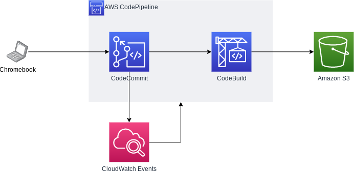

## 今までの構成

今までは、静的CMSである[Hexo](https://hexo.io/)を使ってローカル環境で各ページを生成し、生成されたページをGitHub Pagesで公開する、という構成を取っていました。

この構成を取っていた理由は以下の2つです。

- ブログ記事をMarkdown形式で書くことができ、HTMLを作るために必要なテンプレートや設定ファイルを`git`で管理できるため
- GitHub Pagesは、リポジトリに`git push`さえすればページが公開され、かつ無料で気軽に使うことができるため

しかし思うところがあり、今回、この構成をAWSに移行することにしました。

<!--more-->



## 新たに構築した構成

新たに構築した構成のイメージは以下の通りです。



ポイントは以下のとおりです。

- Chromebookで執筆した記事をCodeCommitに`git push`すると、CloudWatch EventsがCodePipelineを起動する
- CodeBuildが、`/buildspec.yml`に記載された内容に基づき、`hexo generate`を実行する。そして、生成されたHTML（`./public/`配下）をS3バケットと`aws s3 sync`で同期する

これにより、（1）`source/_pages/`にMarkdown形式で記事を書いた記事を保存する、（2）`git commit`と`git push`を実行する、だけで、自動的にブログ記事が公開されるわけです。

## ハマったポイント

### `git clone ssh://git-codecommit.ap-northeast1-amazonaws.com/v1/repos/...`で、`Permission denied (publickey).`が発生し、cloneに失敗する

確認したポイントは以下です。

- `~/.ssh/id_rsa`（秘密鍵）のパーミッションが400になっていること
- Management Consoleの`IAM > ユーザー > 認証情報 > AWS CodeCommit の SSH キー`に、`~/.ssh/id_rsa.pub`の内容が正しく登録されていること

これでもエラーが解消しなかったため、[Troubleshooting SSH connections to AWS CodeCommit](https://docs.aws.amazon.com/ja_jp/codecommit/latest/userguide/troubleshooting-ssh.html)を参考に、`git clone ssh://[my-key-id]@git-codecommit.ap-northeast1-amazonaws.com/v1/repos/...`を実行したところ、`git clone`できるようになりました。`my-key-id`は、IAMから確認できます。

### `buildspec.yml`に記載した`aws s3 sync [src] [dest]`の実行が、`ListObjectsV2`のAccess Deniedエラーで失敗する

[Amazon S3 バケットで sync コマンドを実行すると、ListObjectsV2 で Access Denied (アクセス拒否) エラーが表示されるのはなぜですか?](https://aws.amazon.com/jp/premiumsupport/knowledge-center/s3-access-denied-listobjects-sync/)によると、`ListObjectsV2`の実行を許可するためには、IAMで`s3:ListBuckets`の実行を許可する必要があります。

と、ここまでは良いのですが、何を血迷ったのか、私は以下のように記載し、*`CodePipeline`のサービスロール*にアタッチして3時間ほど悩んでいました。

```yml
{
    "Effect": "Allow",
    "Action": [
        "s3:ListBuckets",
        "s3:PutObject",
        "s3:GetObject",
        "s3:DeleteObject"
    ],
    "Resource": [
        "arn:aws:s3:::.../*"
    ]
}
```

これをアタッチしてから何回もCodePipelineを実行しましたが、毎回毎回`ListObjectsV2`起因のエラーでパイプラインが止まりました。深夜になっていたこともあり、一旦そこで作業を中断しましたが、翌日、CodePipelineではなく、CodeBuildのサービスロールにアタッチしなければ意味が無いことに気が付きました。（`aws s3 sync`を呼び出すのはCodePipelineではなくCodeBuildのため）

## なぜAWSに移行したのか

昨年、Chromebook hp 14aを購入したのをきっかけに、日常作業のほぼ全てをクラウド環境に移行しました。Windows環境が必要なScanSnapを使った書類のスキャンと、開発作業のためにWindows端末を残しています。

ただ、よくよく考えて見ると、Windows端末での作業もChromebookに移行できそうです。

- ScanSnapをWiFi対応のものに買い換えることで、クラウドストレージに直接スキャンデータを保存できるようになりそう
- Windowsで実施している開発も、AWSのサービスをうまく組み合わせればWindows環境なしでもいけそう。Cloud9 + なにか、で出来そう。

特に最近、開発に使っているPCのスペックが時代遅れになりつつあり、必要な時に必要なリソースが取れるクラウド環境での開発に興味が出始めています。開発環境をAWSに移行する際には、Codeシリーズの使い方を少しは知っておく必要があるので、研究を兼ねてAWSに移行しました。

## 今後の構想

以下の5点を年内目処くらいでやっておきたいなと思っています。

- Slackからコマンドを投げると、自動的にPipelineが動作するようにする。
- CloudFrontを使った配信
- S3の非公開化
- 独自ドメインを使ったアクセス
- 開発環境の移行。色々やり方はありそう。EC2/ CodeCatalyst/ Cloud9/ WorkSpacesなど。WorkSpacesを使うなら、Wyseの端末を買ってシンクライアント化するのも面白そうではある

## ちなみに、

この記事は、[富士通のChromebook(14F)](https://www.fmworld.net/fmv/cb/)で、下書きは[Dynalist](https://dynalist.io/)を使って、最終的な整形と`git push`はCloud9を使って書いています。また、構成イメージは[diagrams.net](https://diagrams.net/)で書きました。

## 2023/01/09追記

結局、GitHub Pagesに戻しました。
