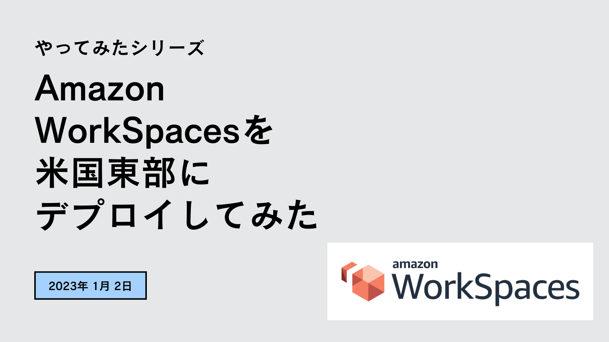
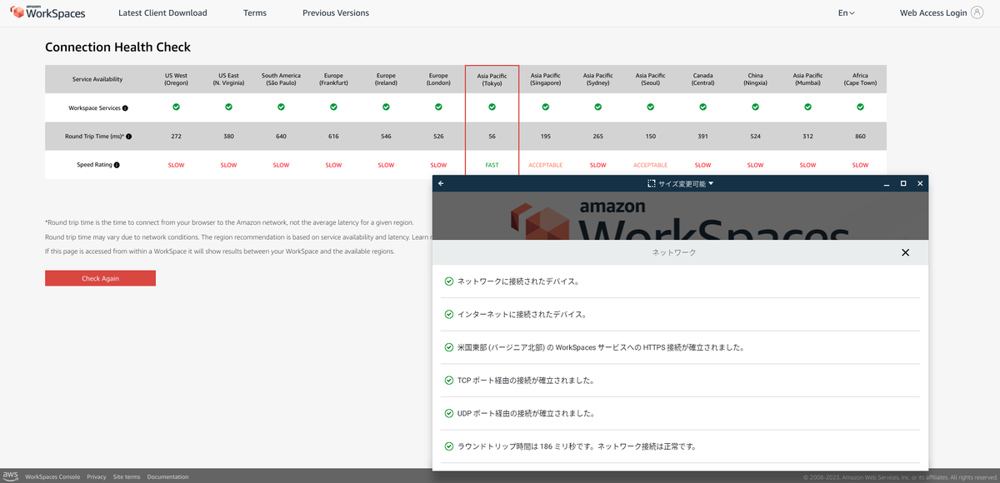
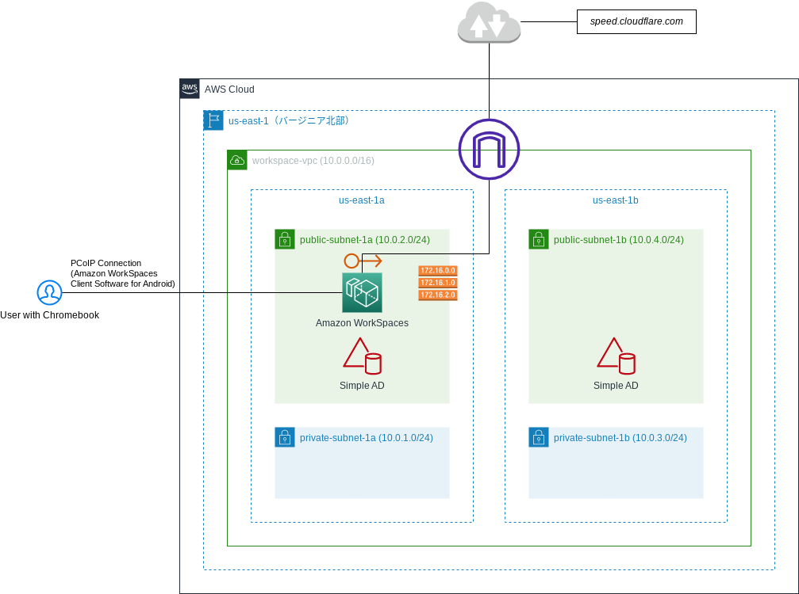

2023年最初の「やってみた」は、Amazon WorkSpacesの検証でした。

<!--more-->



## Amazon WorkSpacesとは

VDI（Virtual Desktop Infrastructure：仮想デスクトップ基盤）の1つで、シンクライアントとも言われます。皆さんがお勤めの企業でも導入されているかもしれません。Windows等のOSがAWSのデータセンター上で動いており、そこにアクセスして作業します。

個人の場合（例えば私の場合）、以下のユースケースがあるかなと思います。

- 日常的な作業の大半はChromebookで出来るが、一部の作業でWindowsが必要、だけどWindows端末は持ちたくない、という場合にスポットで利用
- 特定の国からしかアクセスできないサイトにアクセスする場合に、その国に設置されているリージョンにAmazon WorkSpacesを設定し、アクセス（良く分からないVPNを経由してアクセスするよりもAmazon WorkSpacesのほうがセキュアな可能性があります）

## 背景

Amazon WorkSpacesを試してみようと思ったときに、以下の前提条件で最も費用が安くなるのが米国東部（バージニア北部：us-east-1）です。時間料金を選択すると、1ヶ月あたりの固定費用が9.75 USD/月（約1,227円/月）、利用時間ごとの変動費用が0.30 USD/時間（約40円/時間）です。例えば、月に40時間だけ使うという場合にAmazon WorkSpacesにかかる費用は、9.75 USD + 0.30 USD * 40h = 21.75 USD (約2,845円)です。

### 前提条件

- リージョンは米国東部（us-east）
- Windowsバンドルオプション
- スタンダード（2 vCPU、4GBメモリ）
- ルートボリューム80GB、ユーザーボリューム50GB

ただし、この場合にネックになるのがパフォーマンスです。Amazon WorkSpacesの管理ドキュメントによると以下のような記載があります。

> PCoIP のパフォーマンスを最大限に高めるには、クライアントネットワークからWorkSpaces があるリージョンまでのラウンドトリップ時間 (RTT) が 100ms 未満でなければなりません。RTT が 100 ミリ秒から 200 ミリ秒の間にある場合、ユーザーはWorkSpace にアクセスできますが、パフォーマンスに影響します。RTT が 200 ミリ秒～375 ミリ秒の間にある場合、パフォーマンスは低下します。RTT が 375 ミリ秒を超えると、WorkSpacesクライアント接続は終了します。
> 
> WorkSpaces Streaming Protocol (WSP) の最高のパフォーマンスのためには、クライアントのネットワークから WorkSpaces があるリージョンまでの RTT が 250 ミリ秒未満でなければなりません。RTT が 250 ミリ秒から 400 ミリ秒の間にある場合、ユーザーはWorkSpace にアクセスできますが、パフォーマンスは低下します。
> 
> [Amazon WorkSpaces クライアントネットワークの要件](https://docs.aws.amazon.com/ja_jp/workspaces/latest/adminguide/workspaces-network-requirements.html)

Amazon WorkSpacesの[Connection Health Check](https://clients.amazonworkspaces.com/Health.html)を見ると、日本国内からアクセスしたときの米国東部までのラウンドトリップ時間（以下RTT）は380msと表示されており、上記の記載に照らし合わせるとWorkSpaceにアクセスできないことになります。しかし、実際にはアクセスし、操作できます。ここで確認できるRTTと、実際にWorkSpacesのクライアント（Android版）から確認できるRTTは大きく乖離している場合があるためで、クライアントから確認できるRTTは186msでした。よって、RTTを確認する際には、実機にクライアントを入れて確認するのが一番良いと思います。

## 目的

以下の操作を行い、体感性能がどの程度であるのかを把握します。

- WorkSpacesにログインする
- ソフトウェア（Google Chrome）をインストールする
- Google Chromeで速度測定（speed.cloudflare.com）を行う
- タスクマネージャや設定画面を開く

## 環境

見て分かる通り、private-subnet-(1a|1b)は不要です。なぜ作ったかというと、もともとSimple ADとAmazon WorkSpacesはprivate-subnet-(1a|1b)に配置する計画でしたが、その場合、public-subnetにNATゲートウェイを設置する必要があり、そのコストが勿体ないと気がついたのが、public-subnetの作成後だったからです。

## 結果

作業をしている時に撮影した動画をYouTubeにアップロードしました。



ポイントは以下のとおりです。
- RTTは178ms（2023年1月2日20:00〜20:02に撮影）であったが、軽い作業であればレスポンスが気になることは少ないと思われる
- Google Chromeをインストールし、Chromeで速度測定を行う程度であれば体感上、遅いと感じることはない。ただ、CloudFlareを開いたときの引っかかりはややあるかという程度（Intel Celeron N4020を搭載したChromebook HP 14aでCloudFlareを開いたときよりはマシという程度）
- OSはWindows Server 2016 Datacenter (1607)
- WorkSpaceとインターネット（CloudFlare）の間のダウンロード速度は1.10Gbps、アップロード速度は926Mbps。Ping値は低いがJitter値がやや高い
- 何も作業していない状態で、メモリは51%が使用されており、CPU使用率は5%前後位を推移。割り当てられているCPUは「Intel Xeon Platinum 8259CL CPU 2.5Ghz (2vCPU)」、メモリは4GB

## 今後について

メインマシンをChromebookに置き換えたので、年賀状印刷（特に宛名印刷）だけのためにWindows端末が必要な状況です。WorkSpaceに筆王をインストールし、自宅にVPNで接続後、自宅に据え付けているネットワークプリンタ（DCP-J4140N）を使って宛名印刷が出来るようにしてみたいと思います。今どき、宛名印刷はネットで注文できるのでこのような手間をかける意味は無いですが。
