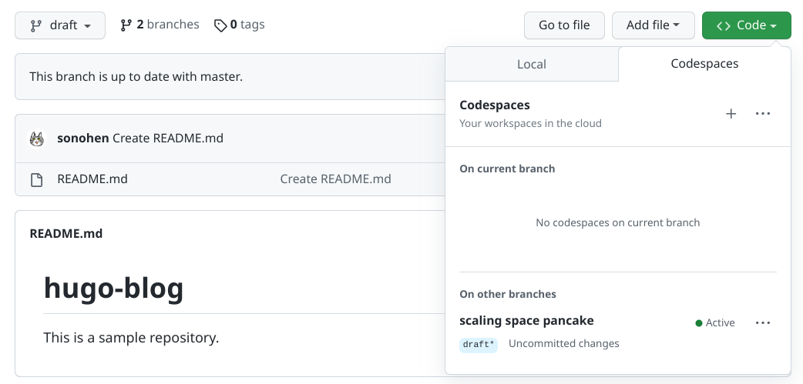
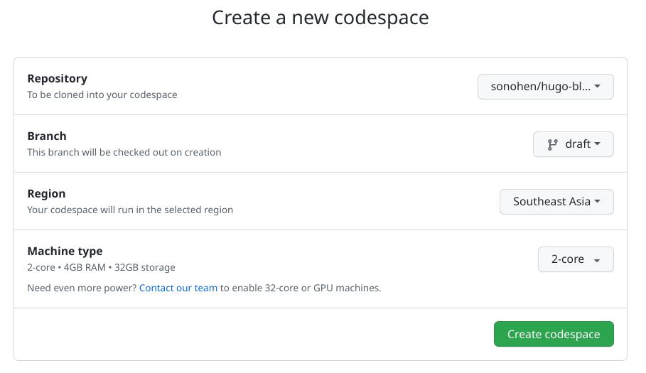
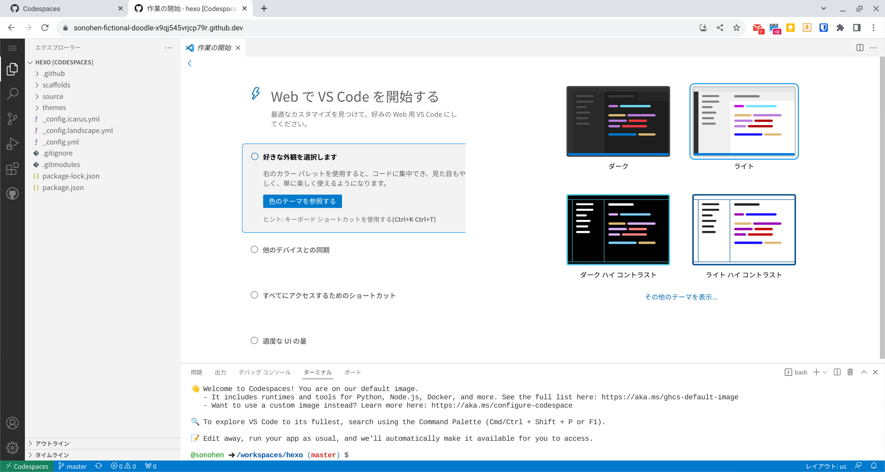
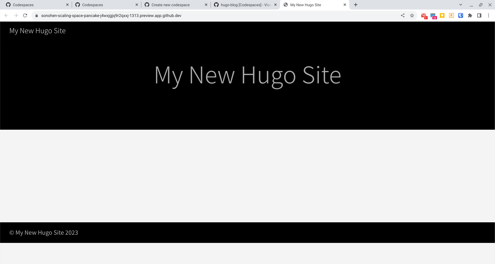
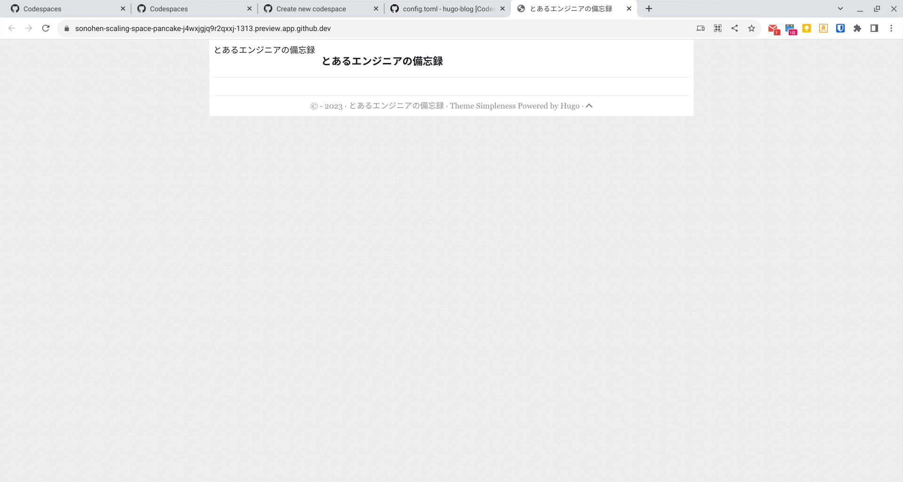
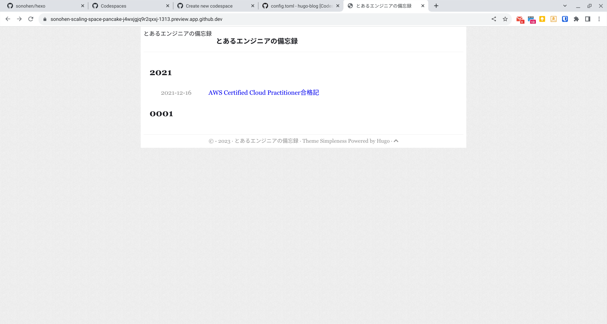

GitHubが提供する、Web版VSCodeを使った開発環境「GitHub Codespaces」を使うことができるようになっていたので、それを使いがてら、静的サイトジェネレータをhexoからhugoに変更し、GitHub Actionsを使ってGitHub Pagesで公開出来るようにしようと思う。

<!--more-->

## 試す上での縛り

- Chromebookで全ての作業（このブログの執筆も含む）を完結させる
- ブラウザ（Chrome）だけで全ての作業（このブログの執筆も含む）を完結させる

## 試す手順

### リポジトリの準備

GitHub上で、プライベートなリポジトリ（ここでは「hugo-blog」とする）を作成しておく。あわせて「draft」という名前でブランチを作っておく。以降、全ての作業はこのdraftブランチを軸に行っていく。

### Codespacesの起動

「hugo-blog」リポジトリ、「draft」ブランチを選択してCodespacesを起動する。



メニューバーの「Codespaces」を選択して起動する方法もある。[Codespaces] > [New codespace]の順に操作し、起動パラメータを以下の通り設定してもよい。



起動後の画面はWeb版VS Codeなり。



### hugoの最低限の設定

初期状態で、hugoはインストールされている（パス：`/usr/local/hugo/bin/hugo`）。hugoの[Quick Start](https://gohugo.io/getting-started/quick-start/#step-3-add-a-theme)に沿って作業を進める。

```Shell
/workspaces/hugo-blog (draft) $ hugo new site . –force
/workspaces/hugo-blog (draft) $ git submodule add https://github.com/theNewDynamic/gohugo-theme-ananke themes/ananke
/workspaces/hugo-blog (draft) $ echo "theme = 'ananke'" >> config.toml
/workspaces/hugo-blog (draft) $ hugo server
```

そうすると、Codespaceの中で動作しているhugoのポートと、外部からアクセスできるアドレス（ローカルアドレス）のバインドが行われ、「ポート」タブに表示される。ローカルアドレスにアクセスすれば、Codespaceの中で動作しているhugoのサーバにアクセスできる。


アクセスすると、以下の通りhugoで作成したサイトが表示される。



一旦、ここまでの変更をコミットしておく。

## hexoからhugoへの移行

ここから先は、hexoからhugoへの移行の記録である。

### submoduleの削除

`themes/ananke`は使わないので削除しておく。

```shell
/workspaces/hugo-blog (draft) $ git submodule deinit -f themes/ananke
/workspaces/hugo-blog (draft) $ rm -rf themes/ananke
```

### テーマの選定

今回はsimplenessというものにした。シンプルでヨシ。

```shell
/workspaces/hugo-blog (draft) $ git submodule add https://github.com/RainerChiang/simpleness.git themes/simpleness
```

### config.tomlの変更

`config.toml`を変更する。とりあえずはデフォルトで記載されている以下のパラメータを変更しておく。動けばヨシ。

```toml
baseURL = 'https://sonohen.github.io/'
languageCode = 'ja-jp'
title = 'とあるエンジニアの備忘録'
theme = 'simpleness'
```

### .gitignoreの作成

以下を追加しておく。

```text
/public/
/resources/_gen/
.hugo_build.lock
```

### 動作確認

ここまでで動作するかを確認しておく。

```shell
/workspaces/hugo-blog (draft) $ hugo server -D
```

`theme/simpleness`は、各種リソースを`localhost:1313`から取得しようとしてしまうのでこれだと正しく動作しない。その場合は、以下のコマンドで対処する。

```shell
/workspaces/hugo-blog (draft) $ hugo server -D --baseUrl="https://sonohen-scaling-space-pancake-j4wxjgjq9r2qxxj-1313.preview.app.github.dev/" --appendPort=false
```

もう少し良いやり方があると思うが、とりあえずはこれで動いたのでヨシ。



ここで一旦、コミットしておく。

### 記事・静的ファイルの移行

hugoの場合、`/content`に記事本体（\*.md）、`/static`に静的ファイル（\*.jpg等）を入れておけば良いらしい。また、hexoで書いていた記事は「hexo」という名前のリポジトリに保存してあるので、スマートではないがとりあえず以下の方法で移行する。

```shell
# 鍵の作成
/workspaces/hugo-blog (draft) $ ssh-keygen -t rsa
/workspaces/hugo-blog (draft) $ cat ~/.ssh/id_rsa.pub # 公開鍵をGitHubに登録する

# 接続テスト
/workspaces/hugo-blog (draft) $ ssh -T git@github.com
Hi sonohen! You\'ve successfully authenticated, but GitHub does not provide shell access.

# 移行作業
/workspaces/hugo-blog (draft) $ mkdir content
/workspaces/hugo-blog (draft) $ cd ../
/workspaces/ $ git clone git@github.com:sonohen/hexo.git
/workspaces/hexo/source (master) $ cp -Rp ./_posts/ /workspaces/hugo-blog/content/
/workspaces/hexo/source (master) $ cp -Rp ./images/ /workspaces/hugo-blog/static/
/workspaces/hexo/source (master) $ cd /workspaces/hugo-blog

# 動作確認
/workspaces/hugo-blog (draft) $ hugo server -D --baseUrl="https://sonohen-scaling-space-pancake-j4wxjgjq9r2qxxj-1313.preview.app.github.dev/" --appendPort=false
```

ここで以下のように表示されればうまく移行できたと思われる。



## GitHub Actionsを利用した自動デプロイ

`/content/_posts/`にMarkdownファイルを作成し、コミットしたら`sonohen.github.io`に表示されるようにしたい。。

そのためにはリポジトリを開き、[Settings] > [Build and deployment] > [Source]からGitHub Actionsを選択し、[Hugo] > [Configure]を選択し、次の画面でCommitすればよい。次のコミット分からGitHub Actionsで自動デプロイされる。
