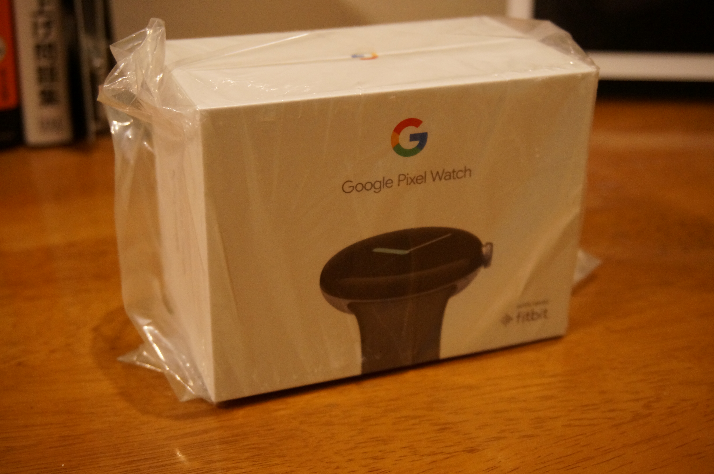
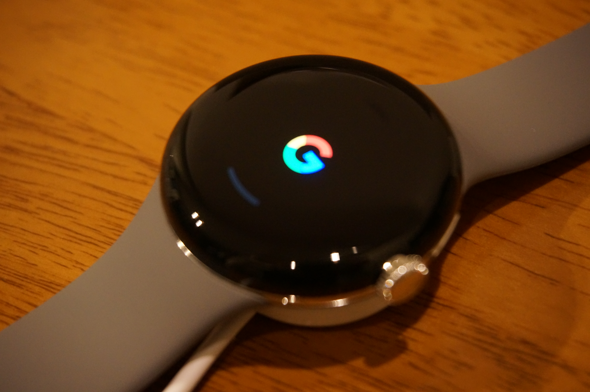

昨年、予約を開始してからずっと悩んでいたが、ついに購入した件。

## 買い方

<dl>
<dt>購入場所</dt>
<dd><a href="https://www.amazon.co.jp/">Amazon.co.jp</a></dd>
<dt>購入金額</dt>
<dd>39,800円（税込）</dd>
</dl>

アメリカン・エキスプレス・カード + メンバーシップ・リワード・プラスで購入したので、100円につき3ポイント（3%）の還元があり、実際に1,194ポイントの還元があった。このポイントを1ポイント1円として使うかどうかは自分次第ではあるが。

<!--more-->

## 写真

## 購入後にやったこと。

1. バンドの装着順を交換した。普段は左手に装着するが、手首を曲げたときにリュウズが左手の甲に当たるため。
2. Google KeepのアプリをPixel Watchに入れた。音声でメモが取れるのはやはり良い。

## よく分からないこと。

1. AnkerのSoundCore Libertyを使っているわけだが、これとPixel Watchのペアリングが必要なのか否か。どうもPixel Watchから、ペアリングしているスマートフォンを通して電話が掛けられるのだが、その音声をPixel Watchのスピーカーやマイクから垂れ流すというのはちょっとできない。
2. Pixel Watch自体に何かファイルを入れたりはできないのか？というよりその辺の思想がよくわからない。Pixel Watchはスマホのインタフェースの1つに当たるのか、それともそれ単独で何かできるようになっているのか。
3. Chromebook、Pixelスマホ、Pixel Watch、他Google製品との連携エコシステムはまだ良くわからないことが多い。このあたりはAppleがよくできていると思う。

## 事前に気になっていたことと現在

事前に調べていて気になった「バッテリーの持ち」は、「常時点灯」と「傾けて点灯」をOFFにしておけば、活動量計＋たまの通知確認程度の自分の用途では少なくとも日中は問題なく持つ。時間を確認するのに、いちいち画面タップが必要なのが面倒ではあるが。「傷の付きやすさ」については分からないが精密機器として丁重に扱っていればつきにくいとは思うがまだ良くわからない。

## 最後に

こんなことを思いながら使っていると、Apple Watchの第2世代を使っていたときのことを思い出す。処理は遅い、バッテリーは持たない、傷は付きやすい。それに比べれば、初代としては完成度は高いのではないか。