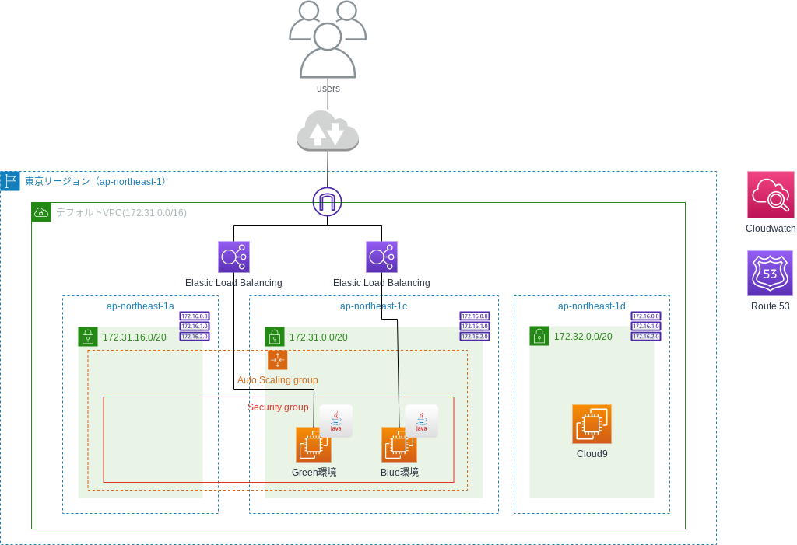
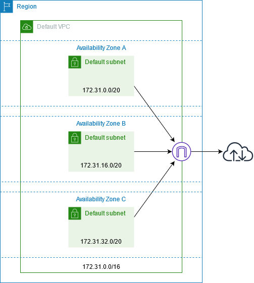
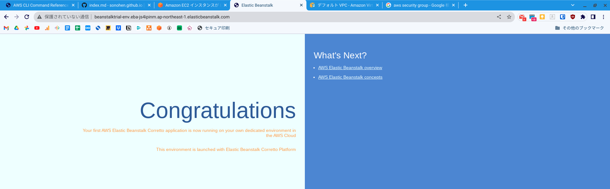

DVA試験（AWS Certified Developper - Associate）対策のため、Beanstalkをハンズオンしてみたので記録しておきました。

<!--more-->



## 目標

1. Elastic Beanstalkを使って"Congratulations"してみる。
2. Blue/Greenデプロイにより、サンプルプログラムの"Congratulations"を"Hello World"に変えてみる。

### 今回の構成



※相変わらず分かりにくい図で申し訳ないです。

## Elastic Beanstalkで"Congratulations"してみる。

### アプリケーションの作成

Elastic Beanstalkは初めて使うため（AWS研修では使った経験あり）、`AWS Management Console`から作成しました。

<dl>
  <dt>アプリケーション名</dt>
  <dd>beanstalk_trial</dd>
  <dt>プラットフォーム</dt>
  <dd>Java</dd>
  <dt>プラットフォームのブランチ</dt>
  <dd>Corretto 17 running on 64bit Amazon Linux 2</dd>
  <dt>プラットフォームのバージョン</dt>
  <dd>3.4.3</dd>
  <dt>アプリケーションコード</dt>
  <dd>サンプルアプリケーション</dd>
</dl>

[Amazon Corretto](https://aws.amazon.com/jp/corretto/)とは、Amazonによる無料の長期サポートが提供されている、Java SE標準と互換性があると認定されているOpen JDKディストリビューションのことです。

作成を開始すると、CloudFormationテンプレートによりスタックが作成されていきます。

### ハマリポイント1　スタック作成でエラーが発生

#### エラー内容

次に、`CloudFormation > スタック > awseb-e-e7d8kvxdpq-stack`を開き、`イベントタブ`を開いたところ、以下のようなエラーが発生し、スタックのステータスは`CREATE_FAILED`になっていました。この時、`ElasticBeanstalk > 環境 > Beanstalktrial-env-2`の環境のヘルスは`保留中`になっていました。

> The following resource(s) failed to create: [AWSEBV2LoadBalancer, AWSEBAutoScalingGroup].
>
> You must use a valid fully-formed launch template. *No default subnet for availability zone: 'ap-northeast-1c'*. (Service: AmazonAutoScaling; Status Code: 400; Error Code: ValidationError; Request ID: 7d99081a-1554-487c-b265-38b01661aa2e; Proxy: null)

このエラーの原因は、デフォルトサブネットが存在しないことです。過去にデフォルトVPCを削除した時に、一緒に削除されたのだと思います。そして、現在はデフォルトVPCのみ作成されている状況です。本来、デフォルトVPCは以下のような構成になっているのが正しいようです。



そこで、以下の手順でデフォルトVPC、デフォルトサブネットを構成し直します。

1. Elastic Beanstalkの環境を削除し、アプリケーションを終了する
2. [デフォルトVPC](https://docs.aws.amazon.com/ja_jp/vpc/latest/userguide/default-vpc.html#create-default-vpc)の記載を参考に、`AWS CloudShell`から以下のコマンドでデフォルトVPCとデフォルトサブネットを作成する[^1]

[^1]: 起動する際、選択しているリージョンに注意してください。今回は、Elastic Beanstalkをap-northeast-1（東京リージョン）で起動したいので、それを指定した後、`AWS CloudShell`を起動しました。

#### 対応1　Elastic Beanstalkの環境を削除し、アプリケーションを終了する

`Elastic Beanstalk > 環境`から、環境を選択し、右にあるアクションから`環境の終了`を選択し、環境を終了します。これにより、アプリケーションの公開も停止されます。

#### 対応2　デフォルトVPCを作成する

`AWS Cloud Shell`から以下のコマンドを実行します。実行しているコマンドの詳細は、[AWS CLI Command Reference](https://awscli.amazonaws.com/v2/documentation/api/latest/index.html)を参照してください。

```plain
aws ec2 create-default-vpc
```

出力例は以下です。

```plain
An error occurred (DefaultVpcAlreadyExists) when calling the CreateDefaultVpc operation: A Default VPC already exists for this account in this region.
```

既にデフォルトVPCが存在すると言われます。そこで、デフォルトVPCの`VpcId`を調べます。

```plain
aws ec2 describe-vpcs --filter Name=is-default,Values=true --query 'Vpcs[].[VpcId]' --output text
```

出力例は以下です。

```plain
vpc-0f48a5ddd72f1781f
```

#### 既に存在するサブネットの削除

今回は、既にデフォルトVPCが存在していました。その配下にあるサブネットがデフォルトサブネットか判断がつかなかった上、他で使っていなかったことから、デフォルトVPCにあるサブネットを削除しておきます。

```shell
for target_subnet in `aws ec2 describe-subnets --filters Name=vpc-id,Values=vpc-0f48a5ddd72f1781f --query 'Subnets[].[SubnetId]' --output text`
do
  aws ec2 delete-subnet --subnet-id $target_subnet
done
```

以下のコマンドを実行し、出力結果が無いことを以てサブネットが削除されたことを確認します。

```
aws ec2 describe-subnets \
  --filters Name=vpc-id,Values=vpc-0f48a5ddd72f1781f \
  --query 'Subnets[].[SubnetId]' \
  --output text
```

#### デフォルトサブネットの作成

以下のコマンドで、各AZにデフォルトサブネットを作成します。

```shell
availabilityzones=(ap-northeast-1a ap-northeast-1c ap-northeast-1d)

for az in ${availabilityzones[@]}
do
  aws ec2 create-default-subnet --availability-zone $az
done

unset availabilityzones
```

作成されたことを確認します。

```
aws ec2 describe-subnets \
  --filters Name=vpc-id,Values=vpc-0f48a5ddd72f1781f \
  --filters Name=state,Values=available \
  --query 'Subnets[].[SubnetId,AvailabilityZone,CidrBlock]'
```

出力例は以下です。

```json {linenos=table, hl_lines=["4-5", "9-10", "14-15"]}
[
    [
        "subnet-090132d78642c5909",
        "ap-northeast-1d",
        "172.31.32.0/20"
    ],
    [
        "subnet-0a941d6e7b4ae578c",
        "ap-northeast-1c",
        "172.31.0.0/20"
    ],
    [
        "subnet-0374fa703f83f7ae1",
        "ap-northeast-1a",
        "172.31.16.0/20"
    ]
]
```

ドキュメントによると、デフォルトサブネットのCIDRは`172.31.0.0/20, 172.31.16.0/20, 172.31.32.0/20`の3つであるということなので、きちんと作成されたようです。

#### インターネットゲートウェイの状況の確認

まず、デフォルトVPCにアタッチされているインターネットゲートウェイの`InternetGatewayId`を調べます。

```
aws ec2 describe-internet-gateways \
  --filter Name=attachment.vpc-id,Values=vpc-0f48a5ddd72f1781f \
  --filter Name=attachment.state,Values=available \
  --query 'InternetGateways[].[InternetGatewayId]' \
  --output text
```

出力例は以下です。

```plain
igw-0adc27eae43d8714d
```

`0.0.0.0/0`宛の通信が上記のInternetGatewayを通るように設定されているか、ルートテーブルを確認します。

```shell
aws ec2 describe-route-tables \
  --filter Name=vpc-id,Values=vpc-0f48a5ddd72f1781f \
  --filter Name=route.destination-cidr-block,Values=0.0.0.0/0 \
  --filter Name=route.gateway-id,Values=igw-0adc27eae43d8714d \
  --output text
```

出力例は以下です。

```json {linenos=table,hl_lines=["15-18", 27]}
{
    "RouteTables": [
        {
            "Associations": [],
            "PropagatingVgws": [],
            "RouteTableId": "rtb-0ef8c99720a501497",
            "Routes": [
                {
                    "DestinationCidrBlock": "172.31.0.0/16",
                    "GatewayId": "local",
                    "Origin": "CreateRouteTable",
                    "State": "active"
                },
                {
                    "DestinationCidrBlock": "0.0.0.0/0",
                    "GatewayId": "igw-0adc27eae43d8714d",
                    "Origin": "CreateRoute",
                    "State": "active"
                }
            ],
            "Tags": [
                {
                    "Key": "Name",
                    "Value": "default-public-rtb"
                }
            ],
            "VpcId": "vpc-0f48a5ddd72f1781f",
            "OwnerId": "436589084651"
        }
    ]
}
```

`0.0.0.0/0`宛の通信が`igw-0adc27eae43d8714d`を通るように設定されていることが確認できました。[^2]

[^2]: もう少し読み進めて頂くと分かりますが、この確認だけでは不十分です。このルートテーブルがデフォルトルートテーブルになっていることを確認するか、あるいはサブネットのルートテーブルの付け替えをしないといけません。

ここまでで、以下の構成が作成されたことが確認できました（以下図は再掲）。


#### ElasticBeanstalkでアプリケーションを再作成する

再度、ElasticBeanstalkのアプリケーションを作成します。アプリケーションの作成に成功すると、`Elastic Beanstalk > 環境`にURLが表示されるので、それにアクセスします。すると、以下のように"Congratulations"と表示されるはずです。



#### ハマりポイント2

私の場合、以前にデフォルトVPCを作成した時に、プライベートサブネット用のルートテーブル、およびパブリックサブネット用のルートテーブルの2つを作っており、デフォルトのルートテーブルは「プライベートサブネット用のルートテーブル」でした。その結果、Beanstalkのアプリケーションを作成した際に、EC2インスタンスは「プライベートサブネット」に配置されており、それが原因でヘルスチェックに失敗する、必要な情報がELB側で取得できない等の問題が発生しました。解決するため、Beanstalkが作ったEC2インスタンスが配置されているサブネットのルートテーブルを「パブリックサブネット用のルートテーブル」に関連付けし直し、環境を再構築しました。

## Hello Worldの作成

### Cloud9環境の構築

サクッと作っておきます。今回は、`ap-northeast-1d`に配置しました。

### Hello Worldの作成

[Elastic Beanstalk resources](https://docs.aws.amazon.com/elasticbeanstalk/latest/dg/RelatedResources.html?icmpid=docs_elasticbeanstalk_console)に`corretto.zip`があるので、Cloud9のターミナルを使ってダウンロードし、展開しておきます。

```shell
wget https://docs.aws.amazon.com/elasticbeanstalk/latest/dg/samples/corretto.zip
unzip corretto.zip -d sample/
```

続いて、`sample/src/main/resources/index.html`を開き、以下のように編集します。

```html {linenos=table, hl_lines=[3,6]}
<html>
  <head>
    <title>Hello World</title>
  </head>
  <body>
    <h1>Hello World</h1>
    <p>This is a end of the Web as there are no links in this page. Hello World.</p>
  </body>
</html>
```

アップロードできるよう、`cd sample; zip corretto-2.0.zip -r .`で圧縮しておきます。

## Blue/Greenデプロイの実行

### 環境のクローン

現在動作している環境をクローンします。`Elastic Beanstalk > 環境`を開き、ラジオボタンにチェックを入れ、アクションから`環境のクローンを作成`を選択します。ひとまずはデフォルト設定のままクローンします。新しい環境の名前は「beanstalktrial-env-1」になりました。現時点で環境は2つあり、それぞれURLは以下の通りになっています。

<dl>
<dt>1つ目（最初）のURL（環境名「Beanstalktrial-env」で、これをBlue環境とします）</dt>
<dd>http://<b><i>beanstalktrial-env.eba-js4ipinm</i></b>.ap-northeast-1.elasticbeanstalk.com/</dd>
<dt>2つ目のURL（環境名「Beanstalktrial-env-1」で、これをGreen環境とします）</dt>
<dd>http://<b><i>beanstalktrial-env-1</i></b>.ap-northeast-1.elasticbeanstalk.com/</dd>
</dl>

1つ目、2つ目のURLにアクセスし、「Congratulations」が表示されていることを確認します。

### ZIPファイルのアップロードとデプロイ

先ほど作成した`corretto-2.0.zip`を、Green環境（Beanstalktrial-env-1）にアップロードし、デプロイします。`Elastic Beanstalk > 環境 > beanstalktrial-env-1`を開き、`アップロードとデプロイ`を選択します。ZIPファイルをアップロードし、デプロイが完了するのを待ちます。

デプロイが完了した後、先ほどの2つ目のURLにアクセスし、「Hello World」が表示されていることを確認します。1つ目のURLは引き続き「Congratulations」になっていることを確認しておきます。

### Blue環境とGreen環境の切り替え

`Elastic Beanstalk > 環境`を開き、Green環境（Beanstalktrial-env-1）を選択し、アクションから`環境URLのスワップ`を選択します。次の画面で、スワップする環境の選択で、環境名に「Beanstalktrial-env」を選択し、`スワップ`を押下します。`最近のイベント`を確認すると、`Swapping CNAMEs for environments 'Beanstalktrial-env-1' and 'Beanstalktrial-env'.`と記載がある通り、スワップはRoute 53のCNAMEレコードの変更によって実現されています。

ここで、`Elastic Beanstalk > 環境`を開き、2つの環境のURLがスワップされていることを確認します。

<dl>
<dt>1つ目（最初）のURL（環境名「Beanstalktrial-env」で、これをBlue環境とします）</dt>
<dd>http://<i><b>beanstalktrial-env-1</b></i>.ap-northeast-1.elasticbeanstalk.com/</dd>
<dt>2つ目のURL（環境名「Beanstalktrial-env-1」で、これをGreen環境とします）</dt>
<dd>http://<i><b>beanstalktrial-env.eba-js4ipinm</b></i>.ap-northeast-1.elasticbeanstalk.com/</dd>
</dl>

これでBlue/Greenデプロイが完了しました。

## まとめ

非常に単純な操作によって、Blue/Greenデプロイが出来ることが分かりました（小並感）。

Elastic Beanstalk自体は、AWS研修でもハンズオンを実施したことがありましたが、やはりそこは研修環境、トラブルなんて起こりません。今回は、自分のAWS環境を使って実行したので、デフォルトVPCやデフォルトサブネットが壊れていたこと、デフォルトルートテーブルがプライベート用になっていたことなど、ここに書いていないことも含めてハマりポイントがありました。過去xx年の経験によって、こういうハマりポイントを経て人は強くなっていくということを身を持って理解していますので、今後も用意された環境ではなく、自分の環境で色々と操作を試していきたいと思います。