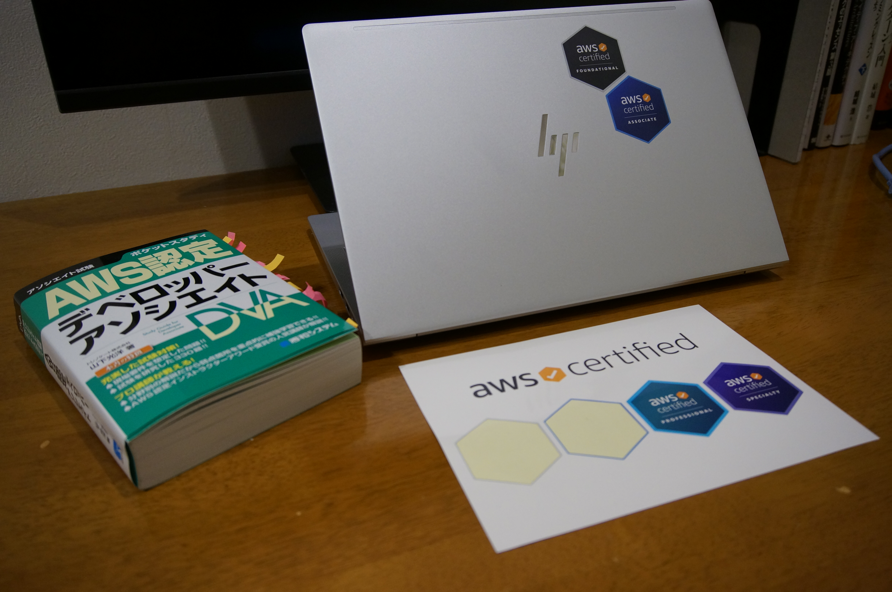

AWS Certified Developer - Associate (DVA-C01)に合格しましたので、その記録を書いておきます。

## 好きなサービス

とりあえず書いておきます。好きなサービスはAmazon S3です。

## 遍歴

- 2021年11月 AWS Certified Cloud Practitioner（CLF-C01）取得（799点）
- 2022年04月 AWS Certified Solutions Architect - Associate（SAA-C02）取得（822点）

そして今回、AWS Certified Developer - Associate (DVA-C01)に合格しました（834点）。これでAWS資格3冠、アソシエイト資格2冠ということになります。

## 勉強方法

### 使った資料

- [ポケットスタディ AWS認定 デベロッパーアソシエイト](https://www.amazon.co.jp/dp/4798063401/)
- [AWS 認定デベロッパー アソシエイト模擬試験問題集（5回分325問）](https://www.udemy.com/course/aws-31955/)
- Black Belt (X-Ray, KMS, Cognito, CodeStar & CodePipeline, CodeCommit & CodeArtifact, CodeBuild, CodeDeploy. Lambdaは見たかったけど量が多すぎてやめた)
- AWS公式ドキュメント
- [AWS Certified Developer - Associate サンプル問題](https://d1.awsstatic.com/ja_JP/training-and-certification/docs-dev-associate/AWS-Certified-Developer-Associate_Sample-Questions.pdf)
- AWS Certified Developer - Associate 公式練習問題集

### 流れ

1. ポケットスタディを一周する
2. Udemyの演習テスト1～5までを解いて、解説を読む。最初の2セットは4割くらいの正答率だが、ちゃんと解説を理解すればこのタイミングで残りの3セットは6割くらいはとれるはず。
3. 弱点となったサービスを洗い出す
4. Black BeltとAWS公式ドキュメントを使って重要なところを整理する
5. Udemyの325問をもう一回解く（正答率は8割前後を目指す）
6. サンプル問題と公式練習問題集を一通り解いておく

ポケットスタディ自体は2023年1月13日に購入しましたが、実際に勉強を始めたのは1月22日からなので、概ね3週間くらいで準備したような感じです。

## Udemyの問題集の難易度

本番試験では、Udemyの問題集ほど複雑な問題は出てきませんが、それに回答するための要素1つ1つを聞いてくるような印象はありました。BlackBeltなどを使って、要素1つ1つをきちんと整理しておかないと合格は厳しいかなと思います。あと、解説が間違っている、あるいは雑な箇所がいくつかあります。解説を読んでいて「いやいやそうじゃないっしょ」と思いつつAWSの公式ドキュメントを読んで、自分の考え方のほうが正しいということを確認しながら進められるようになれば合格できると思います。そういう意味では、ただ解いて解説を読むことを繰り返すよりも、講師と問題集を通してコミュニケーションをするために知識武装するくらいのつもりでやったほうが面白いと思います。CLF、SAAとも同じですが、問題集を解いて、解説を読んで、だけだと合格は不安かなと。

目安として、Udemyで6割だと合格ラインぎりぎり、7～8割だと余裕をもって合格できるかなという印象です。9割とれるようになるまでやる必要はないと思います。

## 次のステップ

AWS Certified SysOps Administrator – Associate(SOA-C02)を3月に取得します。

7月末までにSolutions Architect - Professional、9月末までにDevOps Engineer - Professionalを取得し、その後何か専門知識を取りたいというのが当面の目標です。

## 追伸

[aws certifiedのステッカー](https://aws.amazon.com/jp/blogs/news/taking_aws_certification/)をもらってきました。Foundamentals、Associateは取得したのでノートパソコンの天板にステッカーを貼っておきました。ProfessionalとSpecialityは、まだ取得していないので自粛しています。

微妙にアピっていきます。では、また明日から頑張りましょう。
