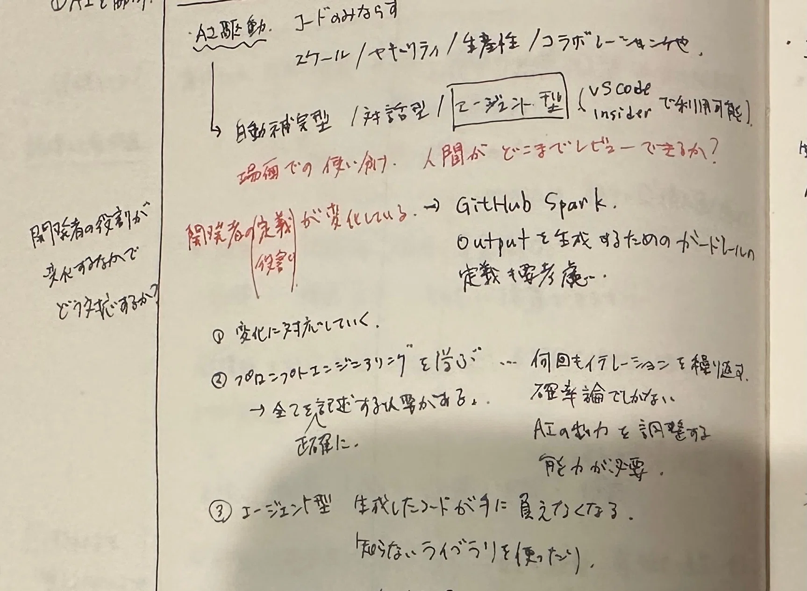
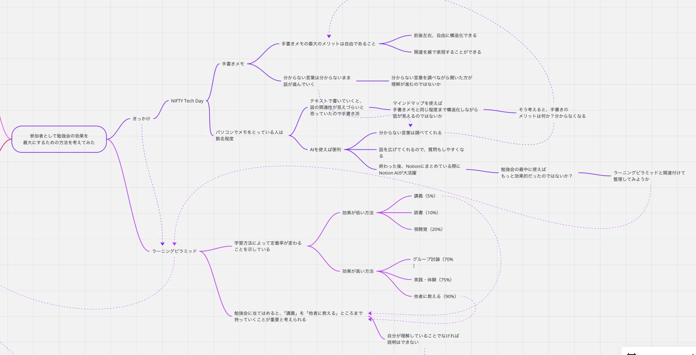
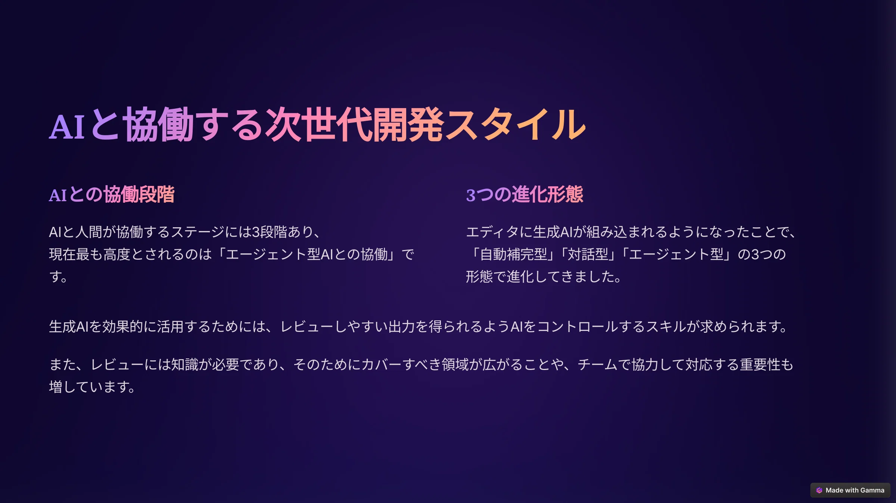

先日、[NIFTY Tech Day 2025に参加しました](../../02/09/)。

その中で、学習方法によって定着率が変わるという「ラーニングピラミッド」の概念を知りました。せっかく参加した勉強会、定着率を上げたいと思いますよね？

あまり時間をかけず、定着率を上げるための方法を検討してみたので、共有させてください。

## きっかけ

私は手書きでメモを取る派でした。いろいろな意見があると思いますが、私が考える手書きメモの最大のメリットは自由であることです。前後左右、自由に構造化できますし、関連を線で表現することもできます。

その一方で、分からない言葉が出てくると、スマホや辞書などを使って調べて、調べた結果をメモに書くことになります。この方法では、分からない言葉が多発してくる場合に、いささか不便です。

ふと思い浮かんだのは「マインドマップを使ってメモを取れば良いのでは？」というありきたりな考えです。手書きメモに近しい自由度で書くことができますし、分からない言葉はその場でAIに聞き、回答をマインドマップに反映することができます。

今回、勉強会中のメモは手書き、勉強会後のまとめにはNotionを使いました。分からない言葉は手書きメモに印をつけておき、NotionでまとめるときにNotion AIに聞きながら整理しました。AIを勉強会中に使えばもっと効率的、効果的だったのでは、と思いましたが、手書きメモ、およびマインドマップとAIの組み合わせでは、どちらの方が定着率が高まるのかが分からない状況でした。

## 定着率を高めるには（ラーニングピラミッドによる「他者への教授」）

そこで出てくるのがラーニングピラミッドです。学習方法によって定着率が変わるということを示すもので、定着率が低いもの、高いものにはそれぞれ以下があります（括弧内は定着率）。

- 定着率が低いもの　講義（5%）、読書（10%）、視聴覚（20%）
- 定着率が高いもの　グループ討論（70%）、実践・体験（75%）、他者への教授（90%）

勉強会は「講義」でしたので、これを「他者に教える」ところまで持っていくことが定着率を高める上で有効であると考えました。

## とはいえとはいえ、時間がなければ機会もそう恵まれるものではない

とはいえとはいえ、の元ネタ。

勉強会に出るところまでが精一杯で、その後、内容を整理して、その上、人に教えている時間まではない、というのがほとんどではないでしょうか。私は、過去に何回も勉強会に参加したことはありますが、その場でメモを取る程度で、勉強会の後に整理し、さらに人に教える、ということはやったことがありませんでした。そのメモも、どこへ行ったかわかりません。

とはいえ、ラーニングピラミッドが示すように、人に教えるということの効果は無視できるものではありません。

まず考えたのは、人に教えるということです。会社の勉強会はあるにはありますが、スケジュールが微妙な時があります。それに、そもそも適した勉強会がなかったりします。そこで、「noteでもどこでも良いので、勉強会の内容をシェアするということをやってみてはどうだろうか？」ということです。インターネットであれば、時間の制約なくいつでも見てもらえるので、「人に教える」ことの代替手段になるのではないかと考えました。

ここでポイントになるのは、内容を整理するところにかかる時間をいかに短縮できるか、です。

まず、人に教えるためには自分が理解していなければいけません。勉強会終了時点で、自分の頭の中が構造化されており、不明な言葉がない状態になっていることが理想です。そのために最も重要なのは「勉強会中に分からないことを解消しておく」ことです。常にAIに触れるようにしておき、分からない言葉が出てきたらAIに調べてもらうのです。それでも分からないことは質問してみましょう。勉強会が終わるまでに内容を理解しておくことが大切です。

次に、すぐに共有できる状態にしておくということです。先ほど「noteでもどこでも良いので」と書きましたが、共有先はインターネットです。その際、扱いやすいデータは共有に使うプラットフォーム次第ではありますが、私の場合はnoteを使っているので、Markdown形式が最も扱いやすい形式です。note以外にも、NotionやGammaもMarkdownをサポートしています。

人に教えられるように理解したトピックを、Markdownのように自分が扱いやすいデータにしておく。これが時短しながら内容を整理するために必要なことだと考えます。

## 実例と改善点

### メモをメモ帳で取る @ 勉強会中

#### 今回

今回は、勉強会のメモを手書きで取りました。いくつか分からない言葉がありましたが、その言葉には後で調べられるように印をつけておきました。

#### 今後

このプロセスは必要ありません。手書きでメモを取るということは、それをデジタル形式に変換する必要があるということで、その手間がかかります。今後は、はじめからマインドマップにメモを取ろうと考えています。これも後で整理する必要がある点で手書きメモと変わりませんが、コピペができる分、手間は省けます。

### 整理しながらNotionに転記する @ 勉強会後

#### 今回

勉強会が終わった後、メモ帳に書いたメモをNotionに転記しました。後から見返してもわかるように記述すること、先に印をつけた言葉を調べました。この時に、Notion AIが大活躍しました。時間にして約1時間程度はかかりました。

復習にもなるので良いプロセスだとは思いますが、本質的には不要なプロセスです。なぜなら、メモを整形するという過程において定着率は上がらないからです。分かっているものを読んでも学習効果がないのと同じです。

#### 今後

Miroのマインドマップでメモをとり、その裏で言葉をすぐに調べられるようにperplexity.aiでも動かすことにして、今後はこのプロセスは廃止したいと考えています。

### Notionからnoteに転記する @ 勉強会後

#### 今回

勉強会の情報は、タイトル、開催日時、場所、そして先にまとめた勉強会の内容をNotionに集約しています。今後も、この取り組みは続けていきたいと思っています。

#### 今後

今後は、勉強会ごとに作ったマインドマップをNotionに取り込んでおくことにしたいと思います。

そして、マインドマップをもとにnoteに掲載する記事を執筆します。このプロセスは、自分用のメモから、人に教えるための記事を起こすことになるので、読みやすく、わかりやすく記載する必要があります。このプロセスは脳を活性化しますので、定着率の向上に貢献します。しかし、マインドマップであらかじめ視覚的に構造化していますので、まっさらな状態から記事を起こすよりも時間はかかりません。

ここで書いた記事は、noteに掲載します。Notionにまとめている勉強会の情報には、noteのURLも記載しておきます。こうすることで、自分用のメモと、人への共有に使った記事の両方が勉強会の情報から参照できるようになります。

### NotionからGammaに転記する @ 勉強会後

#### 今回

noteの記事をGammaにコピペすれば、ある程度の形になってプレゼンテーション用の資料が作られました。適当に手直しをし、保存しておきます。Gammaの共有リンクを、Notionに記録している勉強会の情報に追記しておきます。

## 終わりに

今回書いていて思いましたが、マインドマップでメモをとるということは、マインドマップの外にある情報（過去のマインドマップ）とリンクを直接的に取る方法がない、ということになります。この点、メモはトピックを超えて相互参照しやすいというメリットはありそうです。この点をどう運用するかは今後考えなくてはと思いました。

そもそも思いましたが、勉強会中にパソコンを立ち上げていると、後ろの人から覗き見されて「そんなことメモしてるのかよ」と思われそうだなと思いました。

## 参考

手書きメモの一部。これをMarkdownに変換するのは結構めんどい。

この記事のマインドマップ。このように構造化し、関連を線で表現すれば手書きメモ並の自由度は得られそう。

手書きメモをMarkdownに変換し、それをGammaでスライドに変換したもの
