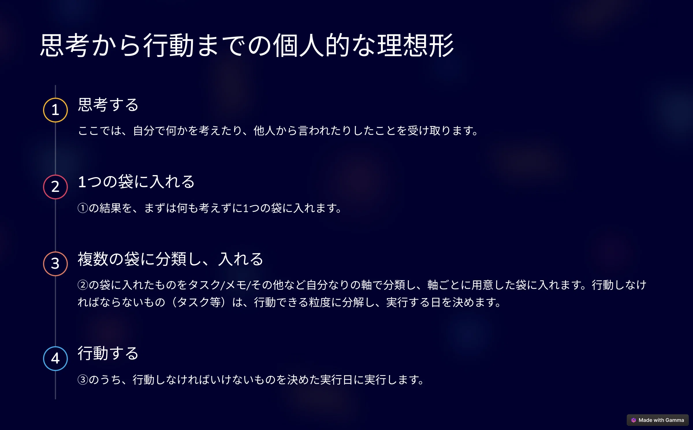

ある程度、Apple Watchの使い方に慣れている方を対象にしています。

## 思考と行動の関係と本記事の結論

前提である「思考と行動の関係」を整理したいと思います。人それぞれ色々な考え方があると思いますが、私が考える思考と行動の理想的な関係は以下の図に示すものです。

このように「思考と行動の間に2つの袋を置くことで、思考と行動はスムーズに連係する」というのが私の考え方です。それぞれの袋をわかりやすく表現すると以下のようになります。

- **忘れないための袋**:　メモアプリ（Draftsなど）
- **行動するための袋**:　カレンダーアプリ、リマインダーアプリなど

本記事が最も言いたいことは、以下の3点です。

- 2つの袋は、完全にデジタル化する。
- 「忘れないための袋」はDraftで管理し、取りこぼしなく集約するために、Apple Watch Ultra 2から音声入力で情報を記録する。
- 「行動するための袋」は、情報の種類に応じてカレンダー/リマインダー/Notion/今日の支出で管理し、「忘れない袋」を定期的に確認してそれらに移す。

以下で詳細を示します。

## 2つの袋は整理されていなかった

まず、2つの袋は管理されていませんでした。具体的には以下の状態でした。

- 忘れないための袋　Moleskine、Onenote、Notion、付箋紙、iPhoneのメモ
- 行動するための袋　Google Calendar、iCloud Calendar、紙のカレンダー、付箋紙、iPhoneのリマインダー、Todoist、Omni Focusなど

こうした状況でも、仕事や日常生活に支障は出ていませんでした。散らばっていても、その様は本人が一番よくわかっているということです。一番の問題は、「やりたいことができなくなっていた」ことです。情報が散らばっていると、情報の格納と検索で脳が疲労状態になります。そうすると、何をすれば良いのかが段々とわからなくなってきます。夢やビジョン、趣味に向かって計画し、実行できている実感が薄れてきます。

今まで、何度かこうした管理を徹底してきましたが、少し油断すると上記のような状態になってしまうのが常でした。改善しなければと考えていた時、Apple Watch Ultra 2のアクションボタンのことを思い出しました。「うまく活用できれば、思考と行動の理想形を実現できるのではないか」と考え、Apple Watch Ultra 2を購入し、改善に取り組みました。

## 改善後

それぞれ、以下のように整理をしました。

- **忘れないための袋**:　Draftsに音声入力する。
- **行動するための袋**:　Draftsに登録されたメモを識別・分類し、予定はGoogle Calendar、タスクはリマインダー、メモはNotion、支出は今日の予算に登録する。

## 実現できた理由はApple Watch Ultra 2によるものが大きかった

これが実現できた理由には、大きく直接的な理由と間接的な理由の2つがあります。

まず、直接的な理由はApple Watch Ultra 2を購入したことです。画面サイズが大きく、処理性能が高いので、ショートカットやアプリを画面上に多く配置できたり、音声入力の精度やアプリの起動速度に不足はありません。

次に、間接的な理由で、これには2つあります。

1つがリモートワーク環境になったことです。これにより、仕事中でも音声入力ができるようになりました。同僚から予定が送られてきても、Draftsに音声で予定の情報を入れておけば良いのです。

もう1つが、Siriやアプリを活用しやすくなったことです。これはApple Watch Ultra 2の画面サイズや処理性能の高さに関連するものですが、音声認識が速くなったことでSiriが使いやすくなっていますし、アプリに関しては文字が見やすくなったり、起動速度も申し分ありません。

そして、Apple Watch Ultra 2のアクションボタンです。物理的なボタンが具備されており、それを押下すると、あらかじめ設定したアプリが起動します。私はこれにDraftsを起動するショートカットを割り当てています。起動する敷居が高いもの（ネガティブ感のあるもの：お金や体重管理など）をアクションボタンに割り当てると、そうしたものも管理しやすくなるかもしれません。私は、Apple Watch 10も所有していますが、物理ボタンの利便性は極めて高いです。

## ワークフロー

ここでは、私が試し、改良しているワークフローを紹介します。

### 思考で得た情報は、まず1つの袋に入れる

#### 2つの重要なこと

1つは、**自分に降りかかってくる情報に対して、反応的な行動をしないこと**です。スマホを見ていると、通知が多く送られてきます。それに反応しているうちに1日が終わってしまった、ということもあるのではないかと思います。通知を受けて即、行動しなければならないものはほとんどなく、いちいち反応していては時間がいくらあっても足りません。まずは、情報を「忘れないための袋」に入れ、対応は後で考えるということを原則にした方が良いと考えています。

もう1つは、**分類しないこと**です。ここでの目的は、とにかく全ての情報を1つの袋に入れることです。情報の分類は脳の負担が大きい行為です。これをしてしまうと、1つの袋に情報を入れることが面倒になり、やらなくなります。そうして待っているのは、管理不能な状態で、日常に追われる毎日です。

### 「忘れないための袋」に情報を格納する

ここでは、Draftsというアプリを使います。このアプリのコンプリケーションをApple Watchのフェイス画面に設定します。そして、これをタップすると、すぐに音声入力ができる状態になります。

使い方は以下のサイトに詳しく書いてありますので、ご参考になさってください。

[すべてのメモの入り口を「Drafts」にすれば迷いがなくなる](https://teineini.net/20191114-memo-drafts/)

### 「忘れないための袋」に入っている情報は、定期的に識別・分類し、別の袋に移すか捨てる

この時点で、「忘れないための袋」に入っている情報は玉石混合です。これらの情報が何なのかを識別し、適切な場所に移します。例えば、「2月25日17:00　山田さんと打ち合わせ」という情報が入っていたとすると、これは予定に分類できます。このほかに、私は以下の4つに分類しています。

- 予定
- タスク
- 残しておくべき価値のあるメモ
- 支出

個人的な感覚として、これ以上増えると利用するツールが増えてしまうので、5つくらいまでに押さえておいた方が良いのではないかと思います。

そして、分類ごとにツールを選びます。私の場合は、予定は「Google Calendar」、タスクの場合は「リマインダー」、残しておくべき価値のあるメモは「Notion」、支出は「今日の予算」で管理していますので、Draftsからそれぞれのツールに転記していきます。

このように、全ての情報は「忘れないための袋」（Drafts）に格納した後、識別・分類し、予定/タスク/残しておくべき価値のあるメモ/支出は、「実行するための袋」（Google Calendar/リマインダー/Notion/今日の予算）に格納され、維持していくことが重要です。

さらに、タスクについては、リマインダーの中にinboxという、何も整理されていないタスクを入れる場所を作っています。それらのタスクは、GTD（Getting Things Done）というメソッドを使って管理しています。詳細を知りたい方は以下のサイトを参考にするとわかりやすいと思います。

## コツ

「忘れないための袋」から「実行するための袋」に移す敷居を下げる　タスクの場合は「インボックス」など、何でも受け入れる袋を作っておくと、まずはそこに移せば良いことになるのでおすすめ。

面倒でも毎日、袋分けをする　量が増えると手がつけにくくなり、管理不能になる。

同時に複数のツールを使わない　例えば、カレンダーにGoogle Calendarを使うと決めたら、しばらくはそれを使い、他のカレンダーツールは使わない。どっちに書いたかわからなくなり、情報が分散してしまうため。完全に移行する場合なら大丈夫ですが、同種のツールを並行して使うのは絶対にやめた方が良いです。

体系的に整理されたものを学ぶ　GTDは、結構前から整理されたタスクの管理手法なので、それを学ぶことで自分のやり方にカスタマイズしていくと運用がうまく回るようになる。

後から検索できる、そしてApple Watchなどに通知されるツールを使う　可能な限りデジタル化することが望ましい。アナログの場合は、検索や通知の面でデジタルに劣るため。

この結果、2025年にどのような成果を得たか

2025年1月から2月23日までの成果です。

- 以下の資格を取得しました。
  - AWS Solutions Architect Professional - Professional（2025年1月）※2024年12月頃から勉強してました。2025年1月の勉強計画は、この記事の方法で対応したということで記載しています。
  - AWS SysOps Administrator - Associate（2025年2月）

- 18冊の本を読みました。
- 縁あって、4月から念願だった大学院（MBA）に単科生として通うことになりました。

これらは、日常のごちゃごちゃしたものを整理し、やりたいと思っていたことにリソースを使うことができるようになったからに他なりません。

## よかった点

2つあります。

1つは仕組み化ができたことにあります。これによって、情報の取りこぼしがなくなり、情報がどこに格納されているのかも把握された状態になるため、自信につながりました。また、物事を忘れなくなりました。厳密にいうと、自身の脳ではなく外部の脳が記憶し、後から探すことができる状態になっている、あるいは必要な時に通知される状態になっています。

もう1つは、やらないことが増えた点です。思考は、「忘れないための袋」と「実行するための袋」を経て、実行されることになります。その過程で、意味不明なタスクやメモなどを消すようにしたため、残ったものは確実に実行できるもの、そして価値があるものになります。その結果として、1つのことに投下できる資源が増え、質が上がり、短時間でも大きな成果を出すことができたと考えています。

## 改善したい点

3つあります。

1つは、袋間の移動を手動にしている点を省力化したいと考えています。手作業で行うと、作業ステップが増えるため、間違えたり、そもそもが面倒になったりします。Draftsのプレミアムプランに申し込めば「アクション」というものが使えるため、それを使って省力化できないかと考えています。

次に、音声入力できない場面での対応です。音声で入力できない局面はどうしてもあります（電車や職場など）。そうした場面で、効率よく、取りこぼしなくメモが取得できないかを考えたいと思っています。

最後に、アナログとの統合です。以下の記事でも書きましたが、マインドマップを使う方法によっても、なおアナログの利点には敵わないと考えています。アナログメモをどう扱うかはよくよく検討する必要があります。
