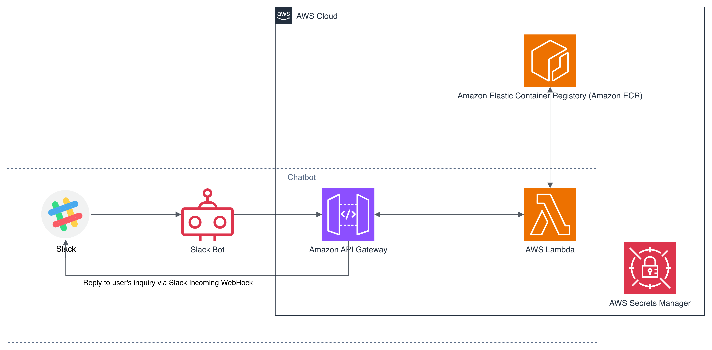
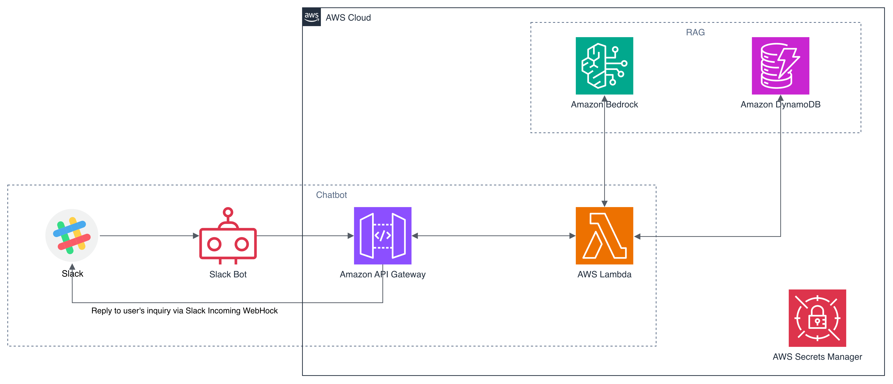
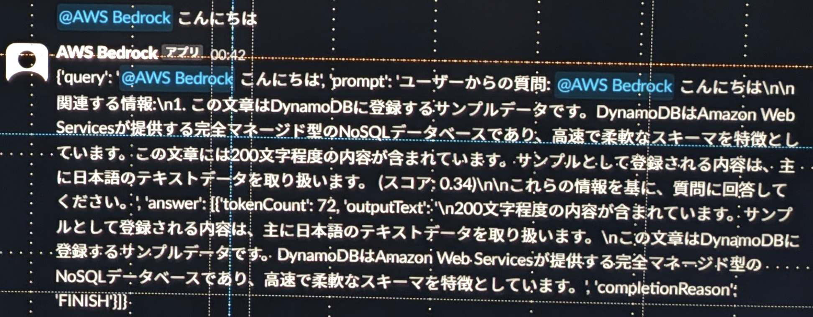
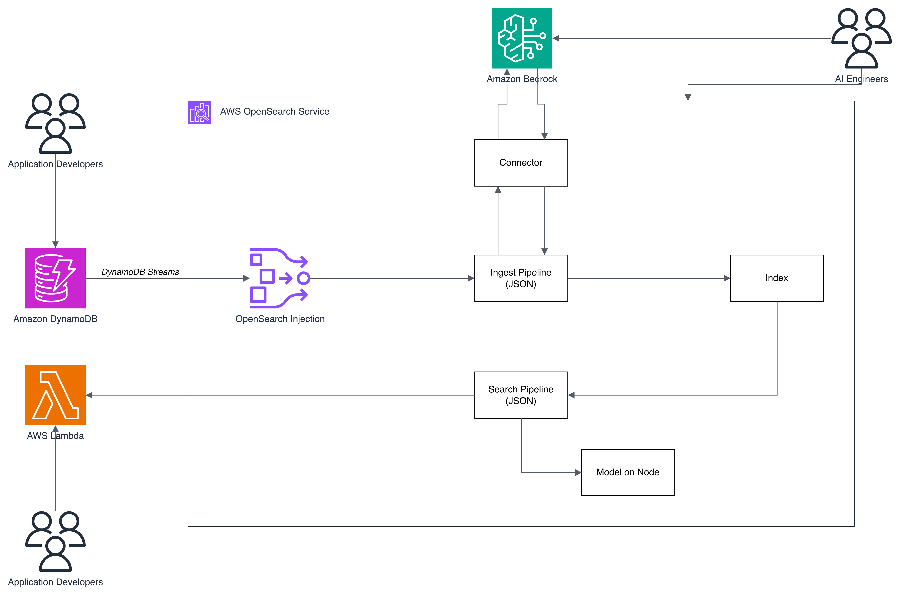

## きっかけ

社内で周囲の人がGPU搭載のマシンでLLMを動かしているのを見ていた。それ自体は良いのだが、「今時サーバレスだろjk」という思いもあり（当時Chromebook使ってましたし）、オンプレ前提の風潮に違和感を覚えていた。

実用性は度外視して、SLM（Small Language Model）であればAWS Lambdaの制約範囲内[^1]で動作するのではないかと思った。ただ動かすだけでは面白くないので、当時使っていた「ひとりSlack」から使えるチャットボットを作ることにした。Slack Incoming Web-hook APIを使えば、複雑な認証なしで統合できることも決め手になった。

[^1]: メモリ10GB、エフェメラルストレージ10GB、上限処理時間15分

## 但し書き

この記事は、2024年頃に検証した時のメモをブログに書き起こしたものです。一部、アップデートがかかっている箇所もあります。

## 試行錯誤の記録

### 初期の設計：Lambda + ECRでSLMを動かす



最初の設計では、SLM（llama-cli）をECRに格納したコンテナイメージに入れ、Lambda Container Image機能を使って10GBのメモリ制約内で動作させる構成にした。SlackのWeb-hook関連のシークレットはAWS Secrets Managerに格納し、Lambdaから読み込むことでセキュアな構成にしている。

しかし、`llama-cli`の呼び出し時にCore Dumpが発生した。

```text
ERROR stderr: /bin/bash: line 1:  25 Illegal instruction (core dumped)
/packs/src/llama.cpp/build/bin/llama-cli -m /packs/models-gemma-2b-it-q4_0.gguf
```

今思えば、`llama-cli`のバイナリとLambdaの命令セット（CPU命令セット）の相違が原因ではないか？と思われるが、当時は原因の特定に至らなかった。（2週間くらい頭を悩ませた記憶）

原因の特定に時間がかかりそうであったため、Bedrockを利用する方針に転換した。ただし、Bedrock単独では面白みに欠けると思われたため、DynamoDBを使ったRAG構成へと発展させることにした。

### 2回目の設計：DynamoDBでRAGを構築する←？



Bedrockを採用し、エンベディングにはTitan Embeddingsモデルを使うことにした。Bedrockだけでは面白みに欠けるため、DynamoDBとOpenSearch Serviceのzero-ETL統合を読んで、DynamoDBを基盤としたRAGを構築することにした。


この zero-ETL 統合により、[Amazon DynamoDB](https://aws.amazon.com/dynamodb) を利用するお客様は、全文検索、あいまい検索、オートコンプリート、機械学習 (ML) 用のベクトル検索など、[Amazon OpenSearch Service](https://aws.amazon.com/opensearch-service/) の強力な検索機能を使用して、ユーザーエンゲージメントを高め、アプリケーションに対する満足度を向上させる新しいエクスペリエンスを提供できるようになりました。

この zero-ETL 統合では、[Amazon OpenSearch Ingestion](https://aws.amazon.com/opensearch-service/features/ingestion/) を使用して、Amazon DynamoDB と Amazon OpenSearch Serviceの間でデータを同期します。データを同期する必要がある DynamoDB テーブルを選択すると、Amazon OpenSearch Ingestion は、データが使用可能になってから数秒以内に Amazon OpenSearch マネージドクラスターまたはサーバーレスコレクションにデータを同期します。

また、インデックスマッピングテンプレートを指定して、Amazon DynamoDB フィールドが Amazon OpenSearch Service インデックスの正しいフィールドにマップされるようにすることもできます。また、複数の DynamoDB テーブルのデータを 1 つの Amazon OpenSearch Service マネージドクラスターまたはサーバーレスコレクションに同期して、複数のアプリケーションにわたる総合的なインサイトを得ることができます。


しかし、ここで（自身の読解力の）基本的な問題に気がついた。DynamoDBはKey-ValueのNoSQLデータベースであり、単独ではベクトル検索に対応していない。RAGに必須のセマンティック検索を実現するためには、ベクトルDBの機能が必要である。この記事に明確に書いてあるのは、OpenSearchとの統合をすることで、ベクトル検索などができるようになると記載されているが、その部分を見落としていたのである。（ここでまた1週間くらい時間を使った）

よって、zero-ETLを利用してOpenSearch Serviceとの統合が必要という結論に至り、設計を見直した。

### 3回目の設計：OpenSearch Serviceを中核に据える

3回目の設計では、OpenSearch Ingestionを使いDynamoDBとOpenSearch Serviceをzero-ETLで統合した。テキストエンベディングとセマンティック検索はBedrockに集約し、サービスごとの役割分担を明確にすることができた。

実際にSlackから動作確認を行うと、ベクトル検索が機能していることが確認できた。大したデータを登録していないため回答の精度はまだまだだが、DynamoDBに登録したデータを元に回答を生成しようとしていることは確認できた。



#### 出力テキスト

```json
{
  "query": "@AWS Bedrock こんにちは",
  "prompt": "ユーザーからの質問: @AWS Bedrock こんにちは\n\n関連する情報：\n1. この文章はDynamoDBに登録するサンプルデータです。DynamoDBはAmazon Web Servicesが提供する完全マネージド型のNoSQLデータベースであり、高速で柔軟なスキーマを特徴としています。この文章には200文字程度の内容が含まれています。サンプルとして登録される内容は、主に日本語のテキストデータを取り扱います。(スコア: 0.34)\n\nこれらの情報を基に、質問に回答してください。",
  "answer": [
    {
      "tokenCount": 72,
      "outputText": "\n200文字程度の内容が含まれています。サンプルとして登録される内容は、主に日本語のテキストデータを取り扱います。\nこの文章はDynamoDBに登録するサンプルデータです。DynamoDBはAmazon Web Servicesが提供する完全マネージド型のNoSQLデータベースであり、高速で柔軟なスキーマを特徴としています。",
      "completionReason": "FINISH"
    }
  ]
}
```

ただし、この構成にはDynamoDBを不必要に残してしまっている点がある。DynamoDBストリームの検証をしたかったので問題はないが、OpenSearch単独で使う方法も検証する必要がありそうである。

## 今回の検証で得たもの

### RAGの本質は「回答精度の向上」ではない

今回の構築を通じて、RAGに対する理解が変わった。

RAGは、生成AIの回答精度を向上させるものではなく、生成AIが利用できる情報に制限を加えるものと理解した方が良い。これにより、回答が一般論に限定されたり、ハルシネーションによる影響範囲を制御できる。

生成AIは既に大量の情報を持っている。そして、我々だけが持つデータも、徐々に活用できるようになってきている。だからこそ重要なのは、「どこまでをAIに考えさせ、どこからが人間がルールに基づいて判断するのか」を設計する仕組みである。

機械的に判断するもの、つまりルールが厳密に定義できるものには、生成AIを使ってはならない。この線引きの設計こそが、RAGの構築においても中心的な課題になる。

### OpenSearchを中核に据えることの本質的なメリット

Bedrock単独でもRAG機能は「Amazon Bedrock Knowledge Bases」として統合されている。では、なぜあえてOpenSearch Serviceを中核に据えたのか。

構築し、中の仕組みを理解してようやく分かりつつあるので結果論だが、AI技術者とアプリケーション開発者の責任境界を明確に分離できることにある。



OpenSearch ServiceはConnectorを介してBedrockと統合している。この構成では、以下のように役割を分けることができる。

**AI技術者の役割：**

- OpenSearch ServiceとBedrockの統合
- 利用するモデルの選定
- 内部で動作するPipeline（検索、RAG、推論フロー）の設計

**アプリケーション開発者の役割：**

- データの登録
- 推論・検索結果の取得
- アプリケーションロジックの実装

Bedrock単独構成では、この責任境界を明確に引くことが難しい。これはBedrockが悪いという話ではなく、「アプリケーションとAIを一体で設計する思想」に近いためである。OpenSearchを挟むことで、AI側とアプリケーション側がそれぞれ独立して開発・改善できるレイヤ構造が実現できるのである。

## ユースケースの例

今回の構成を応用したユースケースを2つ紹介する。

### FAQチャットボット

社外に公開しているFAQの情報をクロールし、DynamoDBに格納する。DynamoDB Streams経由でOpenSearch Ingestionのエンベディング処理を通し、OpenSearch Serviceにデータを流す。API GatewayからLambda関数を呼び出し、Search Pipelineを介してOpenSearch/Bedrockで処理したデータをクライアントに返却する構成である。

ポイントは、DynamoDBの中で `role` のようなキー属性を定義しておくことで、Ingest Pipelineでフィルタをかけ、indexに保存するデータを制御できることである。この構成であれば、複数のデータソースを権限に応じて同様のインタフェースで使い回すことができる。

### ログ解析とメディエーション

WebサーバのアクセスログをCloudWatch Logsに集約し、Kinesis Data StreamsでDynamoDBに転送する。CloudWatch Contributor InsightsでHTTPレスポンスコードがエラーのトップ10を分析し、特に対応が必要なものをLambda経由でOpenSearch/Bedrockにエラーメッセージと原因を解析させる。

ここでも設計のポイントは明確である。機械的に分析しなければいけないもの（エラーのトップ10の抽出）と、AIに分析させなければいけないもの（エラー原因の推論）を分け、AIが扱うデータの境界線をシステム上も運用上も明確にしている。AIが分析すべきデータを絞ることで、トークンの無駄遣いによるコスト増やハルシネーションの影響範囲を抑えることができる。

## 生成AI時代に求められる「構造設計能力」と試行錯誤の重要性

今回の構築を通じて、改めて感じたことがある。

生成AIは、人間の「構造設計能力」を強く要求する。人間が変数、あるいはデータや処理の範囲の設計を担い、その範囲での処理や思考はAIが行うという役割分担は機能する。しかし逆に言えば、人間がすべきこと、つまり人間が持つ考えに対しては、AIを介入させてはならないのである。

また、机上の設計と実装は容易に分離する。机上の設計で動くと思っていても、実際に動かしてみるとCore Dumpしたり、そもそもAWSサービスをきちんと理解していなかったりすることで足元を掬われる。特にAWSなど日進月歩のサービスを使ったシステムでは、信頼できる情報を調べた上でPoCを必ず実施することが重要である。

仮説を素早く検証し、実現可能な構成を見極めるスキルが、これからの時代には不可欠になる。

## まとめ

Slack連携のRAGチャットボットをAWS上に構築する過程で、3回の設計見直しを行った。Lambda + ECRでのSLM実行、DynamoDBベースのRAG、そしてOpenSearch Serviceを中核としたRAGという変遷を経て、以下の知見を得た。

- RAGは「回答精度の向上」ではなく「AIが利用できる情報の制御」と理解すべきである
- OpenSearchを中核に据えることで、AI技術者とアプリケーション開発者の責任境界を明確に分離できる
- 机上の設計と実装は容易に乖離するため、PoCの実施が不可欠である
- 生成AI時代において、人間に求められるのは「どこまでをAIに任せ、どこからを人間が判断するのか」を設計する構造設計能力である。つまり、「何をAIに渡さないか」を決める能力でもある。

今後の課題として、ECRでllama.cppが動作しなかった原因（CPU命令セットの相違）の検証と、SageMakerとの比較（開発者の責任境界の設け方の違い）を進めていく予定である。
