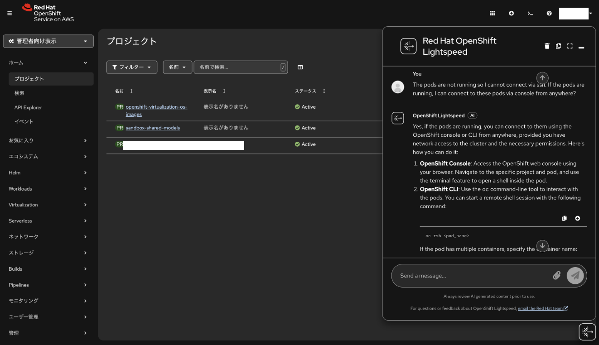
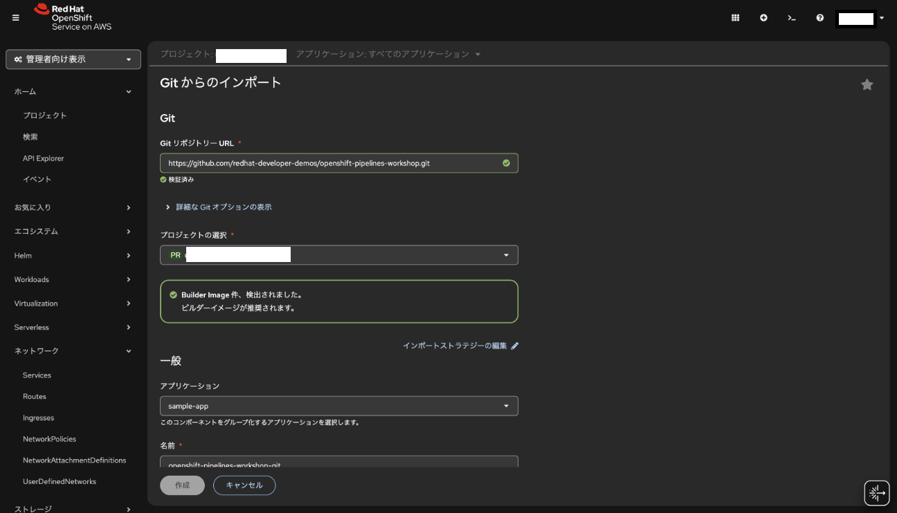

## TL;DR

- AWS は多数のサービスを組み合わせて使う _Service_ の集合体であり、自由度が高い反面、設計・統合の責任は利用者側にある。
- Red Hat OpenShift は業界標準（Git / OCI / Kubernetes）を **強制** する _Platform as a Product_ として設計されており、最初から統合された開発・運用体験を提供することを目的としている。
- Developer Sandboxでは以下の点から、迷わず進める体験が強く印象に残った。
  - Gitリポジトリ指定だけでビルド〜デプロイまで完結する。
  - Podログ・ターミナル・リソース使用量が1画面で確認可能である。
  - AIアシスタント Lightspeed により学習コストが低減している。
- Developer Sandboxの基盤はAWS EC2上で動作しているが、実体はROSA(Redhat OpenShift Service on AWS) 上のOpenShiftであり、マルチクラウドで動作することをログレベルで体感した。
- 閉域網要件やオンプレ併用が求められる企業システムでは、OpenShiftのマルチクラウド設計が大きな強みになる。また、上記の理由から組織の習熟度やスキルに応じて、選択肢の幅を広げていることにもつながる。
- 結論として、AWSは“自由を最大化するプラットフォーム”、OpenShiftは“標準化で速度と再現性を出すプロダクト”であり、優劣ではなく設計思想の違いが現れているのだと実感した。

## きっかけ

普段の仕事では、AWSを使う機会が多い。ECS/Fargate、CodeBuild、Lambdaなど、サービスを組み合わせて作ること、その考え方には慣れてきたが、一方でその「組み合わせる責任」を、常にアーキテクトが負っていることは感じていた。「追いかけ続けるのは大変だ」と思う今日この頃です。

そこで、とあることがきっかけとなりRed Hat OpenShiftが _Platform as a Product_ という考え方で設計されていると知り、それがAWSとどう違うのかを自分の手で確かめてみたくなり、無料で使える _Developer Sandbox_ があると知り、週末を使って触ってみた。

## Platform as a Service vs Platform as a Product

AWSを一言で表すとすれば **サービスの集合体** だろう。EC2、RDS、Lambda、ECSなど、数百に及ぶサービスが並んでおり、利用者はその中から自分のユースケースに合ったものを選び、組み合わせて使う。自由度は極めて高い。

しかし裏を返せば、**どのサービスをどう組み合わせるかの設計責任はすべて利用者にある** ということだ。CI/CDパイプラインを1本作るにも、CodeCommit → CodeBuild → Amazon ECR → Amazon ECSという工程を整え、IAMロール、セキュリティグループなど、自分で判断、設計しなければならない。熟練者には自由だが、習熟の浅いエンジニアには高い壁になる。

それに対して、OpenShiftのアプローチは対照的だ。Git、OCI（ Open Container Initiative、コンテナ規格）、Kubernetesといった業界標準を **強制** することで、開発者が最初からある一定の土台の上に立てる設計になっている。何でもできる、のではなく、標準という枠に沿ってできる、というわけだ。

この「強制」はベンダーロックインの回避にも繋がっている。OpenShiftはAWS/Azure/オンプレミス等で動作する。アプリケーションコードはどの環境でも同じように動く。AWSのマネージドサービスに依存した設計と違い、インフラの切り替えコストが低い。

## Developer Sandboxで試したこと

### Lightspeedとの統合

OpenShiftはコンソールにAIアシスタント **Lightspeed** が統合されている。試したのは、Podが起動していない状態でどうアクセスすればよいかを尋ねる場面だ。

> **私**: The pods are not running so I cannot connect via ssh. If the pods are running, I can connect to these pods via console from anywhere?
>
> **Lightspeed**: Yes, if the pods are running, you can connect to them using the OpenShift console or CLI from anywhere, provided you have network access to the cluster and the necessary permissions. Here's how you can do it:
>
> 1. **OpenShift Console**: Access the OpenShift web console using your browser. Navigate to the specific project and pod, and use the terminal feature to open a shell inside the pod.
> 2. **OpenShift CLI**: Use the `oc` command-line tool to interact with the pods. You can start a remote shell session with the following command: ...



KubernetesやOpenShiftの概念を前提とした回答が返ってくるため、独自ドキュメントを読み漁る前に「なぜこうなっているのか」の文脈を掴める。経験の浅いエンジニアでも自己解決までの距離が縮まる、という点でこの統合は意味が大きいと思う。

### Gitからのデプロイ

まず試したのが、Gitリポジトリからのデプロイである。Developer Sandboxの画面からGitリポジトリのURLを指定するだけで、コンテナのビルドからPod・Serviceの生成まで自動で行われる。



GitHubのリポジトリに限らず、自前のGitサーバ、CodeCommitなど、名前解決できる場所にあれば何でも使える。

AWSで同じことをしようとすると、CodeCommit（またはGitHubとの連携）→ CodeBuild（ビルド設定・buildspec.yml）→ Amazon ECR（イメージ登録）→ Amazon ECS（タスク定義・サービス設定）という順を踏まなければならない。それぞれのサービスの設定と試行錯誤で1日潰れることも珍しくない。

_パイプラインは難しい_ と感じる習熟レベルの人でも、OpenShiftなら最初のデプロイまで数分で到達できる。この体験の差は大きい。

### ログとターミナルの統合

デプロイ後、ログをコンソールから確認してみた。PodのログはOpenShift ConsoleからPod単位でリアルタイムにストリーミングされる。

ログを眺めていると、気になる行が目に入った。

```text
Successfully assigned ***-dev/code-with-quarkus-665467cf97-9rcdb to ip-10-0-86-229.ec2.internal
```

`ec2.internal` が示すように、Developer Sandbox自体のバックエンドはAWS EC2上で動いている。実際には、Red HatがAWS上でマネージド提供するROSA（Red Hat OpenShift Service on AWS）を基盤としており、その上にOpenShiftクラスタが構成されている。このログを通じて、OpenShiftが特定のインフラに依存しないプラットフォームであることを実感した。

AWSでアプリケーションのログを確認しようとすると、CloudWatch Logs → ロググループ → ログストリームという階層を辿らなければならず、慣れていないとどこを見れば良いか迷う。OpenShiftはPodを選べばそのままログが見える。この一体感は確かに違う。

Podへの接続は、コンソールから直接できる。また、OpenShift CLI（`oc`）を使えば、普段使っているターミナルから一時認証情報を使ってPodにアクセスできる。

### リソースの可視化

CPU・メモリ・ファイルシステムの使用状況が時系列グラフでコンソールに表示される。CloudWatchでこれを実現しようとすると、CloudWatch Agentをインストールする必要がある。OpenShiftはデプロイ直後からリソースの状況が一画面で見える。

## AWSとの比較: 閉域網要件

企業システムでよく要件に上がるのが「インターネットに通信を出したくない」という閉域網の要求だ。

AWSで閉域運用を実現しようとすると、VPC Endpoint（各サービスごとに作成が必要）、Route53 Private Hosted Zone（DNS解決の制御）などを組み合わせる必要がある。設定が複雑になるうえ、VPC Endpointによって課金ポイントも増える。予算の制約とのバランスをとることも難しい。

OpenShiftはインフラを抽象化しているため、完全閉域が必要ならオンプレミス、柔軟性が必要ならクラウドという配置場所の変更が、アプリケーションの変更なしに実現できる。組織のクラウド習熟度や用途に応じて、オンプレとクラウドを使い分ける選択肢があり、さらにそれらの移動が比較的容易であると言える。

セキュリティ要件の厳しい業界（金融・公共）への提案を考えると、この柔軟性は大きな差別化点になる。

## 導入事例から読み解く

### Porsche Informatik：6週間でのレガシー移行

市場への投入スピードを競うPorsche Informatikは、プライベートクラウドで動作していたアプリケーションをOpenShiftへ移行した。所要期間は6週間。現在は350人を超える開発者が常時利用しており、Market-inまでの時間を90%向上させたという。

スピードで語られることの多い事例だが、「350人が常時利用」という点も注目に値する。OpenShiftが「強制」する標準的な作法が、大規模な開発組織でのオンボーディングコストを下げていると考えられる。

参考: [Porsche Informatik、Red Hat OpenShift でユーザーエクスペリエンスを促進](https://www.redhat.com/ja/resources/porsche-informatik-partner-case-study)

### JRA（日本中央競馬会）：5000万PVの動的スケーリング

JRAは土日に1日に5,000万PV、平日はそれ以下という極端なトラフィックの波を抱えている。従来のプライベートクラウド基盤で静的にリソースを確保するのではなく、OpenShiftへ移行してHPA（Horizontal Pod Autoscaler）によるPod数の動的な増減で対応しているようだ。

成果として以下のようなものが得られているようである。

- 脆弱性対応の頻度が6ヶ月→2ヶ月に短縮
- 本番リリース作業が5時間→1時間に短縮

脆弱性対応の短縮はローリングアップデートによるOpenShiftコントロールプレーンの更新速度と、DevOpsによるアプリケーション側の対応高速化の両方が効いていると考えられる。本番リリース作業の短縮はBlue/Greenデプロイメントが機能していると思われる。現場の開発者/運用者にとっては非常に大きな改善であると言える。

なお、スケーリング戦略としてHPAを使っているのは合理的だと感じた。もしVPA（Vertical Pod Autoscaler）を使うとPodの再起動が必要になり、複雑さが増す。リクエスト数の波に対してはPod数で柔軟に対応するHPAの方が向いている。

参考: [日本中央競馬会が公式ウェブサイトのプラットフォームにRed Hat OpenShiftを採用](https://www.redhat.com/ja/about/press-releases/jra-adopts-red-hat-openshift-for-its-official-website-platform)

## まとめ

Developer Sandboxを触って感じたのは、自由度と使いやすさのトレードオフに対するRed Hatなりの答えだ。

AWSは設計の自由度が高い反面、その自由を使いこなすための学習コストと、組み合わせの責任を利用者が負う。対するOpenShiftは、標準を **強制** することで、誰が使っても一定の品質と速度でデプロイ・運用できる土台を提供している。

Gitからのデプロイ、ログとターミナルの一体化、Lightspeedとの統合など、これらはどれも「開発者がやりたいことに集中できる環境」を実現するための設計であり、サービスを繋ぎ合わせて仕組みを作らせようとするAWSとは出発点が違う。（念のため、どちらが良い悪いではなく、思想の違いということです）

閉域網要件や既存のオンプレ資産との共存が求められる企業システムにこそ、このプロダクトの価値が発揮される場面がありそうだと感じた。
