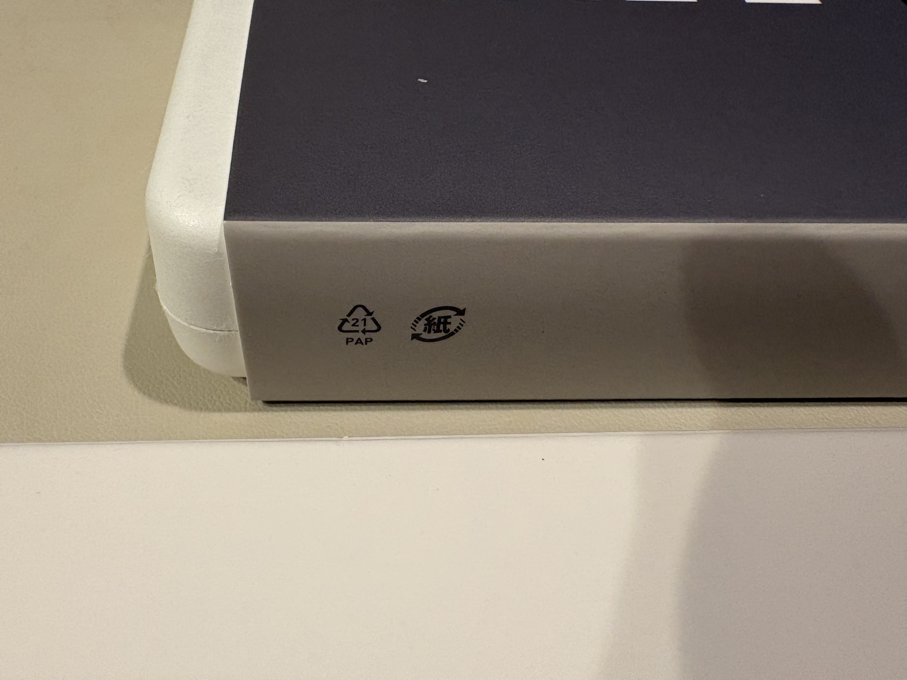
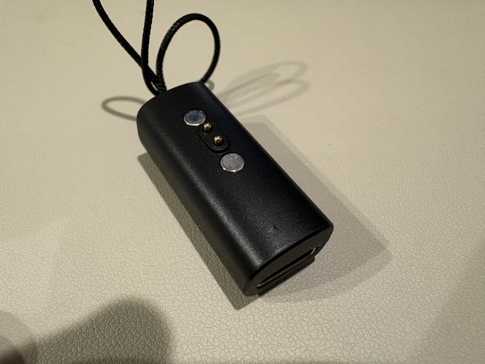

+++
title = "Pebbleのアプリケーション作成のチュートリアルを実施してみた"
date = "2026-09-13T00:00:00+09:00"
tags = ["やってみた"]
description = "以前から気になっていたPebbleのスマートウォッチを購入した。自分でウォッチフェイスやアプリケーションを作ることができるので、それならばということでどんな風に作ればいいのかを知るためにチュートリアルを実施した。"
draft = false
categories = ["Gadget"]
+++

液晶に差し込む光が強ければ強いほど視認性が高まり、バッテリーは1ヶ月近く持つPebble Time 2*。前々から気にはなっていたのだが、途中で消えたこともあり、その後はあまり探していなかった。

先日、何かをきっかけに検索したPebble Time 2*が在庫あり・2営業日以内に出荷すると書かれていたので、この円安の最中、注文した。

[到着前にPebbleのアプリ開発のチュートリアルを実施した時の記録はこちら](../../../2026/09/13/)から参照ください。

# 購入価格

**合計**: 269.52 USD (1 USD = 160.59 JPY計算で、43,281 JPY)

- **本体 (Pebble Time 2 - Silver/Grey)**: 225.00 USD
- **輸送費 (DHL EXPRESS WORLDWIDE)**: 18.00 USD
- **諸税**: 26.52 USD

# 追跡

特に記載がない限り日本標準時(UTC +09:00)。

## 9/12（土）

- 11:44 注文
- 11:47 注文確認（色など）完了

## 9/14（月） - 1営業日目

- 16:42 発送した旨の連絡がPebbleから来る。この時に、DHLの追跡番号も送られてきた。
- 16:47 Pebbleから、「A shipment from order #PBL-XXXXXXX is on the way」というメールが届く。

## 9/15（火） - 2営業日目

- 17:13 (UTC +08:00) 荷物集荷@香港

## 9/16（水） - 3営業日目

- 00:25 (UTC +08:00) DHL仕分け施設に到着@香港
- 03:23 (UTC +08:00) 輸送手配中@香港
- 03:36 (UTC +08:00) DHL施設を出発@香港
- 05:44 通関情報の更新(荷受国到着前に通関手続きを開始する可能性)@成田
- 09:01 次のDHL施設に輸送中@成田
- 09:20 通関情報の更新(荷受国到着前に通関手続きを開始する可能性)@東京(おそらく新木場)
- 10:37 DHL仕分け施設に到着@東京(おそらく新木場)
- 10:55 通関手続き完了@東京(おそらく新木場)
- 11:14 DHL施設にて輸送手配中@東京
- 11:15 DHL施設を出発@東京

以降、最寄りのDHL配送施設に到着し、9/16（水）に荷物を受け取った。

香港→成田間は、時間を考えると恐らくLD208便（3:25香港発・8:40成田着のAir Hong Kongによる運行便）で輸送されたものと思われる。ちなみにこの日は、3:36発・8:21着であった。

# 到着後

色々な方が写真を載せられているので、私が特に気になった箇所だけ写真を載せたいと思う。

## 紙マーク

外国製品なのに、嬉しいものです。

## 充電器は極めて小さい

充電時には、充電器にUSB-Cケーブルを差し込み、Pebble Time 2*本体には磁石で取り付ける。この充電器は極めて小さく、また、先に述べた通り充電はひと月に一回か二回程度であるから、よくよく気をつけて保管しておかないと、充電したい時に充電器を紛失している恐れがある。幸い、磁石がついているので、私は机の脚につけている。

# 最初に開発したアプリケーション

Swarmにチェックインするアプリケーション「Pebblewarm」を開発した。Pebble向けにSwarmの公式アプリケーションが登録されていたのだが、10年以上前に更新が途絶えておりうまく動かなかったためである。

Apple WatchでもSwarmアプリを使っていたのだが、Pebbleにしてからチェックインまでの時間がより短くなったし、Timeline Pinにも登録するようにしているので、何時にどこにチェックインしたのかも分かりやすくなっている。

ちなみに、私はこのようなフローで動かしている。

- 下ボタンの長押しに、Pebblewarmを割り当て
- 場所が表示されたら、選択ボタン長押しでチェックイン

[仕様、ソースコードはMITライセンスで公開](https://github.com/sonohen/pebblewarm)している。[Foursquare Developer Console](https://ja.foursquare.com/developers/home)でプロジェクトを作成してClient ID、Client Secretを入手し、Callback用のページをどこかに配置すれば、それらを使って動かすことができる。興味があればコンパイルして、インストールして動かしてみてほしい。詳細は、`src/README.md`を参照いただきたい。

Pebble Time 2*自体の性能が高くないので、アプリケーションを開発するにあたっても、Pebble本体とスマートフォンそれぞれの役割を考えなければならないなど、制約の中で設計するのはなかなか面白い。いくつか作ってみたいアプリケーションのアイデアがあるので、どんどん設計して実装していきたいと思っている。